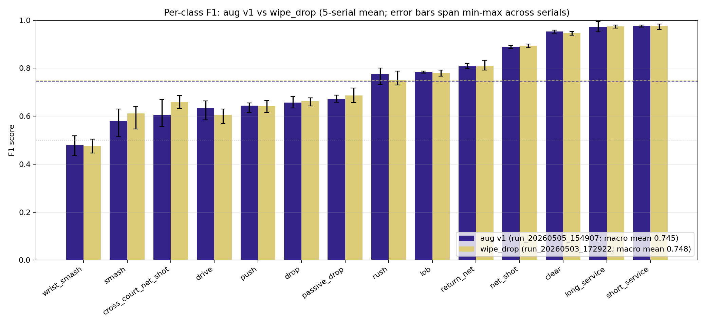

# Badminton Stroke Classifier

Phase 1 of a year-long project with the Hunter Badminton Association to build an integrated badminton autograder. The first stage is a stroke-type classifier trained on broadcast footage; later stages will add rally segmentation, scoring, and player grading. COSC594 and COSC320 capstone, University of New England, 2026.

## What's in Phase 1

A classifier built on the BST skeleton-transformer architecture (Chang 2025, [arXiv:2502.21085](https://arxiv.org/abs/2502.21085)), trained on the ShuttleSet broadcast dataset (~32k stroke clips). Skeleton pose data is cleaned by a custom heuristic that picks one active player from each half-court, rejecting line judges and other on-court figures. TrackNetV3 shuttle coordinates support the pose data, fused through BST's cross-attention block. Class imbalance is addressed by a custom adaptive min-F1 focal loss (CDB-F1). Planning and implementation is finishing up for a third input stream to address feature saturation: a modified and fine-tuned X3D-S 3D CNN that dynamically follows the player's racket arm during the strike window.

### Results on the original BST 25-class taxonomy

TemPose-TF (2023) and BST (Chang 2025) are the two published benchmarks for badminton stroke classification on ShuttleSet. Test-split figures:

| | macro F1 | min-class F1 | acc | top-2 |
| --- | --- | --- | --- | --- |
| TemPose-TF (2023, prior published benchmark) | 0.794 | 0.493 | 0.819 | 0.950 |
| BST paper, variable-length (Chang 2025) | 0.810 | 0.576 | 0.832 | 0.959 |
| Upgraded TrackNet w/ inpaint (`bst_cg_ap_base_17_04_2026`) | 0.823 | 0.585 | 0.841 | 0.963 |
| Training-schedule sweep (`run_20260417_191851`) | 0.830 | **0.627** | 0.844 | 0.964 |
| Keypoint extraction heuristic (`run_20260429_202144`) | **0.831** | 0.577 | **0.849** | **0.968** |


### Results on the project's core 14-class taxonomy

The 25-class taxonomy carries an 'unknown' bucket of mislabelled clips that the model capably identifies, inflating macro and min averages.

The project's target taxonomy drops the unknown bucket, merges Top/Bottom side variants, and splits `smash` and `drop` into pairs (`smash` vs `wrist_smash`, `drop` vs `passive_drop`), forcing nuanced class discrimination:

`smash`, `wrist_smash`, `drop`, `clear`, `lob`, `drive`, `push`, `rush`, `net_shot`, `return_net`, `cross_court_net_shot`, `passive_drop`, `short_service`, `long_service`.

Best run on this set (`run_20260505_154907`, 5-serial mean over the 4,202-stroke test split): macro 0.745 / min-class 0.478 / accuracy 0.764 / top-2 0.939.



Core ablation graph and confusion-matrix charts: [`scratch/presentation_prep/`](scratch/presentation_prep/).

**A second architecture (RGB-3dCNN-core multi-stream) is in development in parallel on the same data pipeline, to meet the need for greater fine-grained action discrimination flagged by the macro-F1 plateau**

Explainable AI activation mapping overlays are currently also in development.

## Project structure

- `src/bst_refactor/` — data pipeline and badminton stroke classifier; standalone subproject with its own pinned environments
- `src/bric/` — BRIC (Badminton RGB Inference Classifier): R(2+1)D-18 backbone with optional shuttle + court fusion lanes. Self-contained: network/dataset/train/infer/eval, plus its own `perception/` (YOLO+TrackNet), `preprocessing/` (cache producers), and `diagnostics/` (cache validators)
- `src/shared/` — values and utilities BRIC consumes: stroke taxonomy, court geometry, player mapping, video I/O, frame-window helpers
- `src/api/` — FastAPI service: model registry endpoints (Tier 1 — browse precomputed predictions), upload + inference orchestration (Tier 2 — inference path currently stubbed)
- `frontend/` — React app, WIP; intended to showcase model inference end-to-end
- `scripts/` — cross-cutting setup and shared data-prep only (e.g. `build_shots_master.py`, `validate_videos.py`, `setup_data.sh`). Per-architecture scripts live with their architecture (`src/bric/preprocessing/`, `src/bric/diagnostics/`)
- `training/` — per-model training data, caches, and run artefacts (gitignored)
- `runtime/` — runtime state for the API + inference jobs (gitignored)
- `scratch/architecture_notes/` — design docs, experiment writeups, taxonomy and loss exploration
- `scratch/presentation_prep/` — charts and eval scripts for milestone reporting
- `tests/` — pytest suite (environment, dataset, API, integration smoke)
- `notebooks/` — EDA and dataset-build notebooks
- `docs/` — decision log

## Data pipeline and classifier training

The classifier has its own pinned environments, separate from the root `requirements.txt`. Three venvs: data pipeline, MMPose pose extraction, BST training. They can't share dependencies; the MMPose skeleton keypoint extractor pins NumPy < 2.0, which conflicts with the rest of the project. Full setup and execution order: [`src/bst_refactor/data_pipeline_to_model_train.md`](src/bst_refactor/data_pipeline_to_model_train.md).

### Local config (`.env`)

Data paths differ between machines (local dev vs `engelbart` vs `bourbaki`). The `pipeline.data_access` tool reads them from a local `.env` file rather than CLI flags.

```bash
cp .env.example .env
# edit .env to point at the four BST_*_DIR paths for your environment
```

`.env` is gitignored. Shell exports always override the file. HPC example paths are commented at the bottom of `.env.example`.

### Inspecting available clips (`pipeline.data_access`)

Lists clips for a given `split` + `class` filter, paired with their shuttle and pose files. Reads from `notebooks/clips_master.csv` under the active taxonomy (default `bst_25`, the most permissive so every clip shows up).

```bash
# Set PYTHONPATH once for the session
export PYTHONPATH=src/bst_refactor:src/bst_refactor/stroke_classification

python -m pipeline.data_access --summary                       # counts per split/class
python -m pipeline.data_access --split val --class Top_smash   # one row per matching clip
python -m pipeline.data_access                                 # interactive prompts
```

Full CLI flags and Python API: [`src/bst_refactor/pipeline/README.md`](src/bst_refactor/pipeline/README.md).

## UNE HPC setup (engelbart, bourbaki)

Training, pose extraction, and eval at scale all run on the UNE HPC GPU nodes. Active collated training data:

```
/scratch/comp320a/ShuttleSet_data_une_v1_14/npy_v2_taxon_pinned_w_preds/
```


### Ongoing run and build notes:

- Use a GPU host (`engelbart` is the project default) for training. Build environments on the GPU host, not on `turing`.
- Keep videos, clips, and generated `.npy` files in `/scratch`, not in your home directory (UNE 40 GB quota).
- Run long training jobs inside `tmux` so they survive SSH drops.
- `/scratch` is **not backed up** and is **local to each HPC host** — data on engelbart's scratch is not visible from bourbaki.

### Symlinks from project into `/scratch`

The pipeline expects clip and pose data inside the repo tree; symlink to `/scratch` so the bulk data lives outside home.

```bash
mkdir -p /scratch/comp320a/ShuttleSet/{raw_video,clips,shuttle_csv,shuttle_npy}

cd ~/badminton_stroke_classification/src/bst_refactor/ShuttleSet
ln -s /scratch/comp320a/ShuttleSet/raw_video raw_video
ln -s /scratch/comp320a/ShuttleSet/clips clips
ln -s /scratch/comp320a/ShuttleSet/shuttle_csv shuttle_csv
ln -s /scratch/comp320a/ShuttleSet/shuttle_npy shuttle_npy
```

Per-taxonomy MMPose output dir, same pattern:

```bash
mkdir -p /scratch/comp320a/ShuttleSet_data_une_v1_14
cd ~/badminton_stroke_classification/src/bst_refactor/stroke_classification/preparing_data
ln -s /scratch/comp320a/ShuttleSet_data_une_v1_14 ShuttleSet_data_une_v1_14
```

After first download, open permissions so the rest of the team can read/write the shared data:

```bash
chmod -R 775 /scratch/comp320a/ShuttleSet
```

**Don't commit these symlinks.** They're host-local and break on every other machine. Add them to your local `.gitignore` if `git status` keeps surfacing them. Pose data is physically taxonomy-independent (same clip → byte-identical pose npy), so a single pose extraction can be reused across taxonomies via filename matching; only the output folder layout differs.

HPC quickstart and GPU notes: [`scratch/hpc_quickstart.md`](scratch/hpc_quickstart.md), [`scratch/gpu-access.md`](scratch/gpu-access.md).

## Experiment tracking

Each training run writes a manifest, per-serial metrics, and TensorBoard events under `src/bst_refactor/stroke_classification/main_on_shuttleset/experiments/<run_id>/`. Optional Aim UI for browsing runs: [`src/bst_refactor/run_tracker.md`](src/bst_refactor/run_tracker.md).

## API + frontend

`./scripts/dev-setup.sh --up` sets up the env files and mount dirs, then starts the FastAPI backend (port 24082) and React frontend (port 5173) via the dev overlay. Drop `--up` to set up only and print the command. Plain `docker compose up` runs the base file alone, skipping the local clip mounts and uploads fix. See `HANDOVER.md` for dev and `DEPLOYMENT.md` for the production stack. Current state: the API + frontend wiring runs end-to-end, but the inference path is stubbed (returns canned predictions). Test suite: `pytest tests/`.

## Team and acknowledgements

COSC594 + COSC320 capstone team, University of New England, 2026, in development for the Hunter Badminton Association. Built on top of BST (Chang 2025, [arXiv:2502.21085](https://arxiv.org/abs/2502.21085)) and the ShuttleSet dataset.

Contributors visible via `git shortlog -s -n`.
