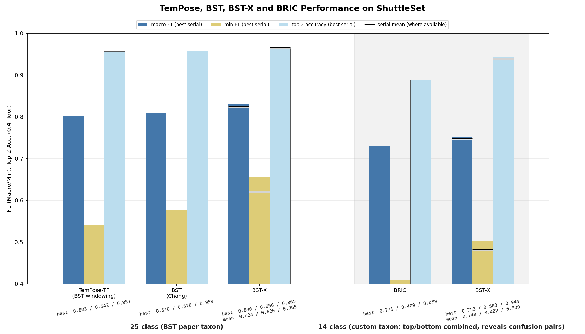
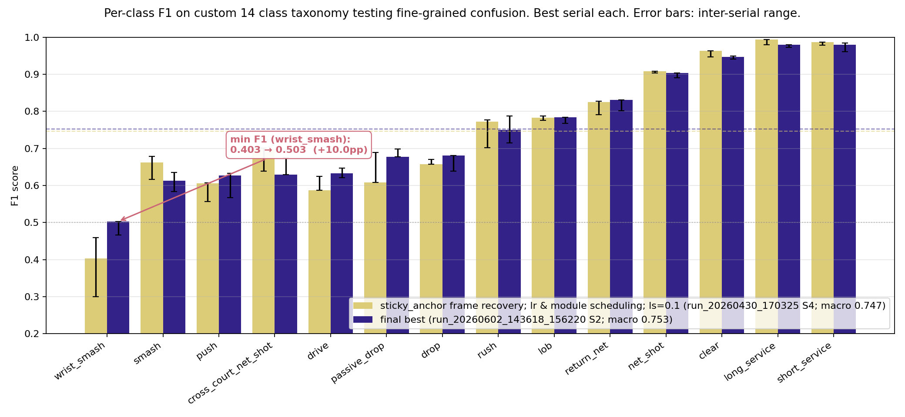

# Badminton Stroke Classifier

In June 2026, we completed stage one of a year-long project to build a badminton auto-grader.

Stage one built a stroke-type classifier across two deep learning architectures, the data pipeline that feeds them, and a deployed web app that browses precomputed predictions over the held-out test set. COSC594 and COSC320 capstone, University of New England, 2026.



## What's in this stage

- **Data pipeline**, automated end-to-end. YouTube match downloads, per-stroke clips, shuttle tracking (TrackNetV3 with Inpaint), player pose extraction (MMPose RTMPose-L, cleaned by a custom `sticky_anchor` heuristic), collated numpy arrays per taxonomy and split.
- **BST-X**, a spatio-temporal CNN/transformer hybrid built on the BST architecture (Chang 2025, [arXiv:2502.21085](https://arxiv.org/abs/2502.21085)). Three streams per clip (pose joints and bones, court position, shuttle xy) fused through BST's cross-attention block. Custom CDB-F1 adaptive focal loss handles class imbalance.
- **BRIC**, an R(2+1)D-18 backbone (Kinetics-400 pretrained) on 32-frame RGB clips, with optional shuttle and court-position side-streams concatenated at the classifier head.
- **Web app**: React + FastAPI. Browses precomputed predictions across six BST-X taxonomy/split variants and one BRIC variant over the full 4,202-clip test set, with per-class F1, confusion patterns, match filtering, and inline clip playback. Upload-to-results wizard wired end to end. Live BRIC inference runs on user uploads when a GPU is available; live BST-X inference runs on single-stroke library-clip requests. BST-X live inference on arbitrary user uploads still falls back to a smart stub (Phase 2 carry).

### Results on the original BST 25-class taxonomy

TemPose-TF (Ibh et al. 2023) and BST (Chang 2025) are the two published benchmarks for badminton stroke classification on ShuttleSet. Test-split figures:

| | macro F1 | min-class F1 | acc | top-2 |
| --- | --- | --- | --- | --- |
| TemPose-TF (BST windowing) | 0.803 | 0.542 | 0.823 | 0.957 |
| BST paper, 25-class (Chang 2025) | 0.810 | 0.576 | 0.832 | 0.959 |
| BST rebuild *with Inpaint*, 25-class (17 April) | 0.823 | 0.585 | 0.841 | 0.963 |
| BST-X final best, 25-class (30 May) | **0.830** | **0.656** | **0.843** | **0.965** |
| BST-X final best, 24-class (30 May) | 0.842 | 0.612 | 0.853 | 0.964 |
| *Custom 14 class taxon and split (two classes uncollapsed, no top/bottom distinction, some fully held-out players)* |
| BST-X, scheduling tuned, dropped keypoint frames recovered (30 April) | 0.747 | 0.403 | 0.770 | 0.940 |
| BST-X, final best (02 June) | 0.753 | 0.503 | 0.773 | 0.944 |
| BRIC, shuttle tcn outgoing only (18 May) | 0.731 | 0.409 | 0.758 | 0.889 |

The 24-class row is the 25-class set with the catch-all `unknown` class removed (a catch-all for mislabelled samples). The first rebuild came in above the BST paper because TrackNetV3 was rebuilt with InpaintNet where the paper ran without it. The final best on top of that adds the `sticky_anchor` pose recovery, the CDB-F1 loss, the augmentation framework, scheduling, and a weight-decay sweep.

### Results on the project's core 14-class taxonomy

The project's primary taxonomy drops `unknown`, merges Top/Bottom side variants, and splits `smash` and `drop` into pairs (`smash` vs `wrist_smash`, `drop` vs `passive_drop`) to force nuanced class discrimination:

`smash`, `wrist_smash`, `drop`, `clear`, `lob`, `drive`, `push`, `rush`, `net_shot`, `return_net`, `cross_court_net_shot`, `passive_drop`, `short_service`, `long_service`.

This taxonomy was paired with a dataset split designed to minimise leakage and maximise class proportion parity per split, as well as test generalisation. Matches remain fully held out between `train`/`val`/`test`. But `test` features several players never seen in `train`/`val`.



The smash / wrist_smash pair sets a sticky min-F1 floor: pose and shuttle don't carry enough forearm and racket rotation to discriminate them reliably. The planned X3D-S wrist-crop fusion stream for BST-X is intended to tackle this directly.

Ablation summary and confusion-matrix charts: [`scripts/plots/`](scripts/plots/).

## Project structure

- `src/bst_x/` — data pipeline and BST-X classifier; standalone subproject with its own pinned environments
- `src/bric/` — BRIC: R(2+1)D-18 with optional shuttle + court fusion lanes. Self-contained: network, dataset, train, infer, eval, plus its own `perception/` (YOLO + TrackNet), `preprocessing/` (cache producers), and `diagnostics/` (cache validators)
- `src/shared/` — values and utilities BRIC consumes: stroke taxonomy, court geometry, player mapping, video I/O, frame-window helpers
- `src/api/` — FastAPI service: model registry endpoints (browse precomputed predictions), upload + inference orchestration (live BRIC uploads + live BST-X library clips; BST-X arbitrary-upload path stubbed)
- `src/xai/` — local keypoint-overlay prototype for inspecting `sticky_anchor` outputs; not wired into the frontend yet
- `frontend/` — React + Vite app; the deployed demo
- `scripts/` — cross-cutting setup and shared data-prep (e.g. `build_shots_master.py`, `validate_videos.py`, `setup_data.sh`, `dev-setup.sh`). Per-architecture scripts live with their architecture
- `training/` — per-model training data, caches, and run artefacts (gitignored)
- `runtime/` — runtime state for the API + inference jobs (gitignored)
- `docs/architecture_notes/` — design docs, experiment writeups, taxonomy and loss exploration
- `scripts/plots/` — charts and eval scripts for milestone reporting
- `tests/` — pytest suite (environment, dataset, API, integration smoke)
- `notebooks/` — EDA and dataset-build notebooks
- `docs/` — decision log, API contract, storage layout, model registry YAML

## Data pipeline and classifier training

The classifier has its own pinned environments, separate from the root `requirements.txt`. Three venvs: data pipeline, MMPose pose extraction, BST-X training. They can't share dependencies; the MMPose skeleton keypoint extractor pins NumPy < 2.0, which conflicts with the rest of the project. Full setup and execution order: [`src/bst_x/data_pipeline_to_model_train.md`](src/bst_x/data_pipeline_to_model_train.md).

### Local config (`.env`)

Data paths differ between machines (local dev vs `engelbart` vs `bourbaki`). The `pipeline.data_access` tool reads them from a local `.env` file rather than CLI flags.

```bash
cp .env.example .env
# edit .env to point at the four BST_X_*_DIR paths for your environment
```

`.env` is gitignored. Shell exports always override the file. HPC example paths are commented at the bottom of `.env.example`.

### Inspecting available clips (`pipeline.data_access`)

Lists clips for a given `split` + `class` filter, paired with their shuttle and pose files. Reads from `notebooks/clips_master.csv` under the active taxonomy (default `bst_25`, the most permissive so every clip shows up).

```bash
# Set PYTHONPATH once for the session
export PYTHONPATH=src/bst_x

python -m pipeline.data_access --summary                       # counts per split/class
python -m pipeline.data_access --split val --class Top_smash   # one row per matching clip
python -m pipeline.data_access                                 # interactive prompts
```

Full CLI flags and Python API: [`src/bst_x/pipeline/README.md`](src/bst_x/pipeline/README.md).

## UNE HPC setup (engelbart, bourbaki)

Training, pose extraction, and eval at scale all run on the UNE HPC GPU nodes. Active collated training data:

```
/scratch/comp320a/ShuttleSet_data_une_v1_14/npy_v2_taxon_pinned_w_preds/
```

### Ongoing run and build notes

- Use a GPU host (`engelbart` is the project default) for training. Build environments on the GPU host, not on `turing`.
- Keep videos, clips, and generated `.npy` files in `/scratch`, not in your home directory (UNE 40 GB quota).
- Run long training jobs inside `tmux` so they survive SSH drops.
- `/scratch` is **not backed up** and is **local to each HPC host**: data on engelbart's scratch is not visible from bourbaki.

### Symlinks from project into `/scratch`

The pipeline expects clip and pose data inside the repo tree; symlink to `/scratch` so the bulk data lives outside home.

```bash
mkdir -p /scratch/comp320a/ShuttleSet/{raw_video,clips,shuttle_csv,shuttle_npy}

cd ~/badminton_stroke_classification/data/shuttleset
ln -s /scratch/comp320a/ShuttleSet/raw_video raw_video
ln -s /scratch/comp320a/ShuttleSet/clips clips
ln -s /scratch/comp320a/ShuttleSet/shuttle_csv shuttle_csv
ln -s /scratch/comp320a/ShuttleSet/shuttle_npy shuttle_npy
```

Per-taxonomy MMPose output dir, same pattern:

```bash
mkdir -p /scratch/comp320a/ShuttleSet_data_une_v1_14
cd ~/badminton_stroke_classification/src/bst_x/preparing_data
ln -s /scratch/comp320a/ShuttleSet_data_une_v1_14 ShuttleSet_data_une_v1_14
```

After first download, open permissions so the rest of the team can read/write the shared data:

```bash
chmod -R 775 /scratch/comp320a/ShuttleSet
```

**Don't commit these symlinks.** They're host-local and break on every other machine. Add them to your local `.gitignore` if `git status` keeps surfacing them. Pose data is physically taxonomy-independent (same clip gives a byte-identical pose npy), so a single pose extraction can be reused across taxonomies via filename matching; only the output folder layout differs.

HPC quickstart and GPU notes: [`docs/hpc_quickstart.md`](docs/hpc_quickstart.md), [`docs/gpu-access.md`](docs/gpu-access.md).

## Experiment tracking

Each training run writes a manifest, per-serial metrics, and TensorBoard events under `experiments/bst_x/shuttleset/<run_id>/`. Optional Aim UI for browsing runs: [`src/bst_x/run_tracker.md`](src/bst_x/run_tracker.md).

## Web app

Bring up the full dev stack (FastAPI backend on :24082, React frontend on :5173):

```bash
./scripts/dev-setup.sh --up
```

This sets up env files and mount directories, then starts both services via the dev overlay. Drop `--up` to set up only and print the run command. Plain `docker compose up` runs the base file alone, skipping the local clip mounts and uploads fix.

Three environments: local dev (Vite HMR on :5173), production (nginx on :26138, single-port and Cloudflare-tunnel friendly), and CI (GitHub Actions). With dataset paths empty the app still boots against ~11 MB of committed sample predictions and 13 sample clips; data-dependent features (per-clip browser, "misclassifications only") hide gracefully on cells without local data.

The browsing path serves all six BST-X registered variants plus the BRIC variant from precomputed gzipped JSON sidecars. The upload-to-results wizard is wired end to end (multipart upload, ffmpeg crop, job queue, status polling, results screen). Live BRIC inference runs on user uploads when a GPU is available (TrackNet preprocessing needs one; BRIC's card is gated off in the backend if not); live BST-X inference runs on single-stroke library-clip requests. Multi-annotation library jobs and arbitrary BST-X user uploads fall back to a smart stub. Wiring a real BST-X forward pass on arbitrary uploads is a Phase 2 carry.

Setup, redeploy steps, and env-var precedence: `HANDOVER.md` and `DEPLOYMENT.md`.

Test suite: `pytest tests/`, plus `uv run python -m bric.smoke_test` for the BRIC environment.

## Next Steps

Continuing into COSC595 with: X3D-S wrist-crop fusion for BST-X to adress the fine-grained discrimination bottleneck, an amateur-footage classifier (self-supervised pretrain on scraped YouTube footage, fine-tune on the pro set), live BST-X inference on arbitrary user uploads, and a CrossTrainer-style (Ashutosh and Grauman 2025) [arXiv:2511.13993](https://arxiv.org/abs/2511.13993) single-shot autograder proof of concept.

## Team

- Ariel Halperin (BST-X, data pipeline), 
- Curtis Martin (backend, deployment, frontend integration), 
- Scott Bailey (BRIC, backend), 
- Kiri Lefebvre (frontend), 
- Isiah Darcy (data splits, research, frontend), 
- Ethan McDonough (initial Docker and HPC scaffolding), 
- Jared Pitman (CI setup, deployment docs).

Built on top of BST (Chang 2025, [arXiv:2502.21085](https://arxiv.org/abs/2502.21085)) and the [ShuttleSet broadcast dataset (Wang et al. 2023)](https://github.com/wywyWang/CoachAI-Projects/tree/main/ShuttleSet).