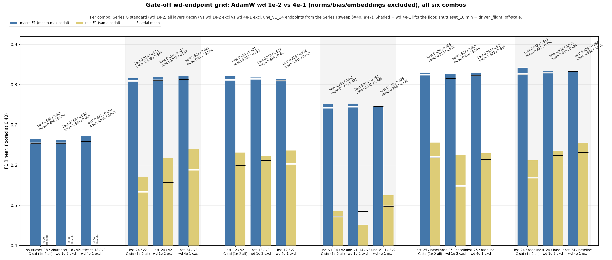
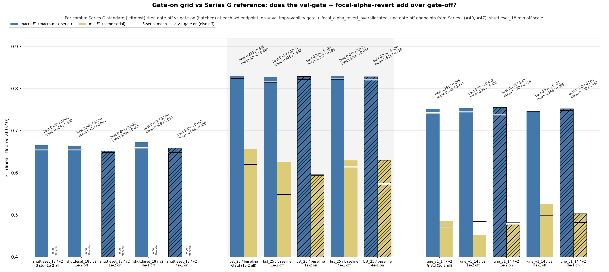
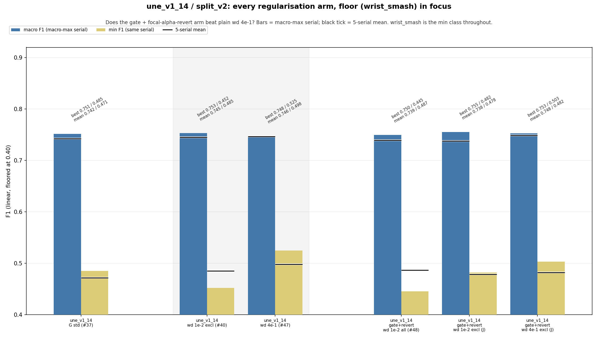

# Series J: weight-decay endpoints + focal_alpha_revert

A 16-cell sweep on the `taxon_pinned_w_preds` collation (carmack, 1-2 Jun 2026), closing out trimester-1 tuning. SET 1 swept the two AdamW weight-decay endpoints (1e-2 and 4e-1, with norms/bias/embeddings held out of decay) gate-off across five taxon/splits; SET 2 crossed the same endpoints with `focal_alpha_revert` on three. Per-cell numbers live in the ledger (Series I and J) and the run manifests; this is the summary.

## What it showed

Three things hold up.

**1. Macro doesn't move.** Every setting here, both wd endpoints, the decay exclusion, `focal_alpha_revert`, leaves macro inside a band smaller than the seed-to-seed spread within a single setting, on every combo. No knob in this batch touched the macro ceiling. Same wall as the rest of the project: macro is signal-bound on the smash / wrist_smash pair, not regularisation-bound.

**2. wd 4e-1 lifts the floor where it started lowest.** Rank the readable combos by their Series G mean min-F1, and wd 4e-1 (with the exclusion) helps the three lowest and does nothing for the two highest:

| combo | Series G mean min | wd 4e-1 helps? |
|---|---|---|
| une_v1_14 / v2 | 0.471 | yes |
| bst_24 / v2 | 0.534 | yes (+5.4% mean min) |
| bst_24 / baseline | 0.568 | yes (+6.3% mean min) |
| bst_12 / v2 | 0.599 | no (1e-2 already had the lift) |
| bst_25 / baseline | 0.620 | no (keep-unknown; stays on the old standard) |

So the heavier decay buys floor exactly where the worst class was starved, and has nothing to give once it's already comfortable. The per-cell gains are noisy (min-F1 swings 5 to 6% seed to seed), but the direction is consistent across the low-floor combos. shuttleset_18's floor is `driven_flight`, one test clip, unreadable either way. **wd 4e-1 with the exclusion is the default optimiser setting going forward**, one setting holds across taxa, at worst about 0.9% below the per-combo best (on bst_12), so no need to tune it per taxonomy.

**3. focal_alpha_revert earns nothing.** Turning it on never gives the best config on any of the three taxa it ran. The one place it lifts anything is bst_25 at wd 1e-2, where it recovers what the bare exclusion gave up, and even there it stays under the old standard. On une, plain wd 4e-1 (no alpha-revert) keeps the better floor. This is the second batch after Series H to say so, so `focal_alpha_revert` can come out of the hp config.

## What to serve

Macro being flat means a swap only earns its keep where the new cell matches Series G on macro and lifts the floor. By that test, **bst_24/v2 wd 4e-1** is the clean one: macro 0.822 vs G's 0.816 (best serial), floor 0.641 vs 0.571. The other candidates are within-noise macro edges (shuttleset_18, une_v1_14) or fail the macro test (bst_24/baseline, where G's top serial still wins macro). The FE swap is cheap, but rebuild the cell's `fe_jsons/` sidecar first.

## Pointers

- Per-run / per-cell numbers: the ledger (`bst_x_training_runs.md`, Series I = wd sweep, Series J = wd × alpha-revert) and the run manifests (each carries `best_serials` + a notes block).
- Plots: `final_sweep_assets/`.
