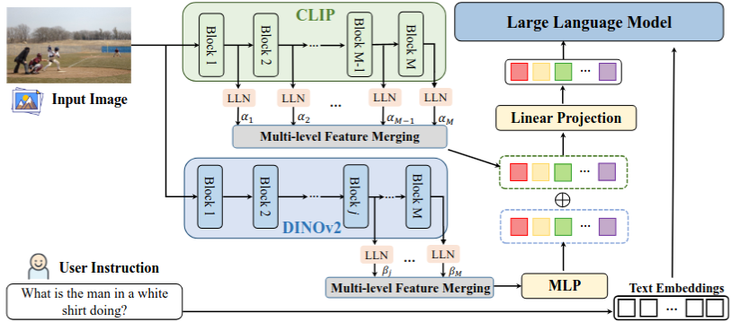

# From CLIP to DINO: Visual Encoders Shout in Multi-modal Large Language Models

*Revoiced for legibility: the prose is tightened. Italic square-bracket asides like* *[this]* *are editorial flags where the source wording is vague or where a claim and the data behind it don't line up.*

**Authors:** Dongsheng Jiang*, Yuchen Liu*, Songlin Liu*, Jin'e Zhao, Hao Zhang, Zhen Gao, Xiaopeng Zhang, Jin Li, Hongkai Xiong
**Affiliations:** Huawei Cloud, Shanghai Jiao Tong University, Yunding Technology

## Abstract

Multi-modal Large Language Models (MLLMs) extend Large Language Models (LLMs) with a visual input interface. Almost all of them use CLIP (or a CLIP variant) as the visual encoder and feed only its deep-layer features to the language model. No one has checked systematically whether that is the right choice. We investigate how different vision encoders behave inside MLLMs.

Two findings stand out. First, CLIP's shallow-layer features help fine-grained tasks such as grounding and region understanding, not just the deep layers everyone uses. Second, DINOv2, a vision-only encoder trained with no text-image alignment, works well as the visual branch: add a single MLP to map its features into the word-embedding space and it beats CLIP on fine-grained perception. Building on this, we propose COMM, which merges CLIP and DINO features across multiple layers ("Multi-level feature Merging"). On image captioning, visual question answering, visual grounding, and object hallucination, COMM outperforms prior methods.

*[Title gloss: "shout" just means the choice of visual encoder matters far more than the field's fixed-CLIP habit assumes. "DINO" in the title and method name refers throughout to DINOv2 specifically.]*

---

## 1 Introduction

LLMs handle a wide range of language tasks, and instruction tuning lets them switch tasks zero-shot from a prompt. The natural next step is to feed them visual input so they can produce text grounded in an image.

Flamingo and BLIP2 did this first, pairing a frozen visual encoder with an LLM. LLaVA, InstructBLIP, MiniGPT-4 and mPLUG-OWL then improved instruction-following by building multi-modal instruction datasets. All of these align vision and language at the whole-image level, which limits fine-grained understanding (region description, spatial reasoning) and leaves them prone to object hallucination.

A second wave added region-level ability. GPT4ROI does instruction tuning on regions of interest. Kosmos-2 and Shikra add grounding, so a user can point to an object and the model replies with bounding-box coordinates (and the reverse).

Despite this variety, almost every MLLM uses CLIP (or a variant) as the visual branch and takes features only from the deep layers, typically the penultimate one. Two problems with that default:

- CLIP is trained on image captions, which give only global, image-level supervision. It aligns well with the word-embedding space but misses pixel-level detail like exact colour and position, which hurts fine-grained perception.
- The visual and language halves are badly unbalanced (for example a ~300M ViT-Large against a 7B or 13B Vicuna). As LLMs scale, the visual encoder becomes the weakest link [the source calls this "the short plate of the Buckets Effect", a translated idiom for the shortest stave that limits a barrel's capacity]. It shows little emergent capability and a clear domain gap. So improving the visual side is the lever for better MLLMs.

This paper studies four representative encoders inside MLLMs: CLIP (image-text contrastive), DINOv2 (image-only contrastive), MAE (masked image modelling) and DeiT (supervised). We evaluate on visual grounding, object hallucination, VQA, image captioning and the MME benchmark.

Findings:

- Different layers carry different biases. Shallow layers hold low-level detail and help fine-grained tasks (grounding, positioning); deep layers are better at global understanding. So we merge low- and high-level features rather than using deep features alone.
- DINOv2, with just an MLP for alignment, is a surprisingly strong visual branch, thanks to the fine-grained localisation it captures.
- MAE and DeiT are both weak here. MAE encodes little semantic information, and DeiT's heavy supervised training produces a feature space that is hard to align with text.

From these we build COMM: fuse CLIP and DINO with multi-level feature merging to strengthen the visual branch. COMM beats existing methods across benchmarks.

**Contributions.**

- The first systematic study of how different visual encoders perform inside MLLMs.
- A multi-level feature-merging strategy that combines low- and high-level features, motivated by the finding that shallow layers carry detail useful for fine-grained tasks.
- Evidence that vision-only DINOv2 works well in MLLMs with only an MLP for alignment, plus COMM, which fuses DINOv2's fine-grained detail with CLIP's global semantics.
- Extensive experiments (visual grounding, referring expression generation, object hallucination, VQA, captioning) showing COMM beats prior work.

---

## 2 Related Work

**Multi-modal LLMs.** Flamingo uses cross-attention to pull visual context, then concatenates it with text tokens for the LLM. LLaVA and FROMAGE use CLIP's encoder and a single linear layer to align vision to text. BLIP-2, mPLUG-OWL, MiniGPT-4 and InstructBLIP use a Q-Former to extract text-aligned visual features. Others extend MLLMs to image retrieval, video, audio, biomedical analysis and control systems.

A second line targets fine-grained, region-level understanding. Kosmos-2 builds a large dataset of grounded region-text pairs. GPT4ROI encodes features per region of interest, using the bounding box as a spatial instruction. Shikra handles spatial coordinates for referential dialogue. Ferret and ViP-LLaVA broaden the referring formats to points, boxes, sketches and scribbles. Qwen reports strong results across tasks.

All of these take features only from CLIP's last few layers, which emphasises global image properties. Our point is that shallower layers focus more on local properties and are better for object location and image detail, and that vision-only models like DINOv2 capture finer features still. We exploit both with a fusion module.

**Vision foundation models.** Recent large-scale visual pretraining splits into contrastive learning, masked image modelling and supervised training. Contrastive learning is either image-only or image-text. DINOv2 pretrains on large curated image data and reads object parts and scene geometry well across image domains. CLIP and EVA-CLIP use natural-language captions as weak supervision. For masked modelling, BEIT predicts discrete tokens from a pretrained tokeniser, iBOT adds an online tokeniser, and MAE reconstructs raw pixels. DeiT III is a strong supervised training recipe. Current MLLMs default to CLIP or EVA-CLIP without weighing each encoder's properties; we are the first to re-examine this and propose a simple, effective fusion strategy.

---

## 3 Analysis of the Visual Branch in MLLMs

The standard recipe: take CLIP features from the last few layers (for example the penultimate), pass them through an alignment network, concatenate with text tokens, and feed the LLM. CLIP's image-text pretraining aligns well with language but learns image-level features and misses pixel-level detail, because captions carry only coarse, global supervision. Its deep layers focus on global properties and underuse local object detail.

> **Figure 1 (feature correspondence).** Cosine-similarity maps for visual tokens, comparing shallow (layer 12) and deep (layer 24) features of CLIP and DINOv2. CLIP's shallow layers and DINOv2's deep layers keep finer, more localised detail about object shape and texture; CLIP's deep layers are mostly global.

Using these detailed features should improve fine-grained perception.

**Evaluation setup.** For each encoder (CLIP, DINOv2, MAE, DeiT, all ViT-Large), take features from a given layer, align them with a single linear projection, concatenate with text tokens, and feed Vicuna-7B. Architecture and training follow Shikra, with fewer iterations to save compute. We measure REC (referring expression comprehension: locate the box for a phrase), REG (referring expression generation: describe the region in a given box), and POPE (an object-hallucination benchmark).

**CLIP as the visual branch.** The best layer depends on the task. REC peaks at the shallow layer 12. POPE keeps improving into the deep layers (better global understanding). REG CIDEr is best around layer 16. So deep-only features, the usual choice, leave performance on the table; combining shallow and deep is better.

*[The shallow/deep labels drift here: layer 12 is "shallow", layer 16 is then called "relatively deep", and 19-24 are "deep". The clean statement is simply that the best layer differs by task (REC ~12, REG ~16, POPE deepest); the shallow-versus-deep framing is looser than it sounds.]*

> **Figure 2.** Average accuracy by layer depth for CLIP, DINOv2, MAE and Shikra. (a) REC: CLIP peaks near layer 12; DINOv2 is strongest in the deep layers (19-24); MAE is well below both. (b) POPE: CLIP and DINOv2 both improve with depth, DINOv2 slightly ahead at the deepest layers. (c) REG CIDEr: CLIP peaks at layers 16-18, DINOv2 around layer 20.

We then test ways of merging low- and high-level features. Write the per-layer outputs of an $N$-layer ViT as $z = [z_1, ..., z_i, ..., z_N]$. The multi-level feature merging (MFM) options:

- **Mean (half):** average the patch-token features of the second half of the backbone, $z = (z_{N/2} + \cdots + z_N) / (N/2)$.
- **Mean (all):** average all layers, $z = (z_1 + \cdots + z_N) / N$.
- **Layerscale (all):** learn one weight per layer and sum, $z = w_1 z_1 + \cdots + w_N z_N$, where the $w_i$ are updated during training and sum to 1.
- **LLN-Layerscale (all):** first pass each layer through a linear + LayerNorm module (LLN) to put the layers into a common feature space, then Layerscale-sum, $z = w_1 \, \text{LLN}(z_1) + \cdots + w_N \, \text{LLN}(z_N)$.
- **Conv-Layerscale (all):** the same idea using a convolution + BatchNorm instead of LLN.

> **Figure 3.** Average REC and POPE for each merging strategy on CLIP and DINOv2. LLN-Layerscale gives the best REC/POPE balance, and the highest scores, for both encoders.

Even plain averaging of CLIP's shallow and deep features works well, and LLN-Layerscale does better still. With LLN-Layerscale as the MFM module, CLIP improves clearly across the standard tasks (Table 1).

**DINOv2 as the visual branch.** DINOv2 holds rich fine-grained detail but is not text-aligned, so we add a non-linear MLP to map its features into the word-embedding space. Its deep-layer features give strong grounding (high REC) and acceptable understanding (POPE, REG).

*[The words "satisfactory" and "favourable" do vague work here. In Table 1 the DINOv2 baseline's POPE (78.3) is below CLIP's (82.3); DINOv2 only overtakes CLIP on POPE once MFM is added (83.3 vs 82.3). Its consistent edge over CLIP is REC (54.8 vs 47.3), not hallucination.]*

Multi-level merging behaves differently for DINOv2. Merging in its shallow features hurts: Mean(all) is clearly worse than Mean(19-24) on both REC and POPE, so DINOv2's shallow layers lack semantic content. Built on LLN-Layerscale, adding the MLP for a stronger vision-text link gives a clear gain.

**Table 1: CLIP, DINOv2 with Multi-level Feature Merging (MFM), and COMM (both encoders fused) on VL tasks.**

| Visual Model | Avg REC | Avg POPE | COCO | Flickr30k | MME CS | MME PS | VQAv2 | OK-VQA |
| :--- | :--- | :--- | :--- | :--- | :--- | :--- | :--- | :--- |
| CLIP | 47.3 | 82.3 | 125.0 | 80.7 | 209.6 | 1107.8 | 68.8 | 44.2 |
| DINOv2 | 54.8 | 78.3 | 118.0 | 68.9 | 261.8 | 930.5 | 63.1 | 41.9 |
| CLIP w/ MFM | 70.0 | 83.4 | 125.8 | 81.0 | 296.6 | 1164.4 | 69.5 | 44.7 |
| DINOv2 w/ MFM | 72.8 | 83.3 | 123.4 | 76.3 | 252.9 | 1086.8 | 68.0 | 42.1 |
| COMM | 72.8 | 83.6 | 127.3 | 81.9 | 360.4 | 1234.9 | 70.1 | 45.0 |

*(REC, POPE, VQAv2 and OK-VQA are accuracy %; COCO and Flickr30k are CIDEr; MME PS = Perception Score, MME CS = Cognition Score.)*

*[Reading across Table 1: COMM's averaged REC (72.8) only matches DINOv2-with-MFM, so within this controlled comparison the fusion adds nothing to grounding; its gains are in POPE, captioning, VQA and, most of all, MME. Note that the full COMM-7B in Table 2 is a separate, longer-trained model that does lead on REC.]*

**MAE and DeiT as the visual branch.** MAE reaches acceptable REC but drops sharply on POPE and REG: it lacks the semantic content needed for global or regional understanding, so it is a poor visual branch. DeiT is worse still; its heavy supervised training learns a specialised feature space that is hard to align with word embeddings.

---

## 4 COMM: CLIP + DINO with Multi-level Feature Merging

**Overview.** COMM merges CLIP and DINO features across layers to strengthen the visual branch. It sits inside a standard vision-language instruction-following model: vision and language in, text out. The visual branch is CLIP + DINOv2 (both ViT-Large) with the fusion strategy below; the language decoder is Vicuna (7B or 13B).

The encoders downsample by 14, so an $H \times W$ image becomes a sequence of $\frac{H}{14} \times \frac{W}{14}$ tokens. The fused tokens pass through a linear layer and concatenate with the instruction tokens for the decoder, which treats every vision-language task as text generation.

> **Figure 4 (architecture).** The image goes to both encoders at once. CLIP blocks 1 to M each pass through an LLN module, are scaled by their alpha weights, and summed. DINOv2's deeper blocks are merged the same way, then passed through an MLP. The DINOv2 and CLIP outputs are concatenated, projected by a linear layer, and concatenated with the user-instruction text embeddings. The full sequence feeds the LLM.

Formally, let $f_1$ (CLIP) and $f_2$ (DINOv2) be the encoders. For an input image $x$, take CLIP's patch features from all layers, $f_1(x) = [v_1^1, ..., v_1^i, ..., v_1^{24}]$, where each $v_1^i \in R^{N \times D}$ ($N$ patch tokens, $D$ dimensions), and DINOv2's deep-layer features $f_2(x) = [v_2^{19}, ..., v_2^i, ..., v_2^{24}]$. Concatenate them: $v = [v_1^1, ..., v_1^{24}, v_2^{19}, ..., v_2^{24}]$.

Align each layer with linear + LayerNorm and merge with Layerscale:

$$\overline{v}_{1} = \sum_{i=1}^{24} \alpha_{i} \cdot \text{Linear}(\text{LN}(v_{1}^{i}))$$

$$\overline{v}_{2} = \sum_{j=19}^{24} \beta_{j} \cdot \text{Linear}(\text{LN}(v_{2}^{j}))$$

where $\alpha$ and $\beta$ are learnable scaling parameters. Project DINOv2's merged features through an MLP and concatenate them with CLIP's, $\overline{v} = [\overline{v}_1, \text{MLP}(\overline{v}_2)]$. A final linear layer matches the visual dimension to the text dimension, $\hat{v} = \text{Linear}(\overline{v})$, and the fused features concatenate with the text tokens as input to the LLM.

---

## 5 Experiments

We evaluate four task groups: referring expression comprehension (REC), referring expression generation (REG), object hallucination (POPE), and VQA + image captioning.

**Training.** Two stages. Stage 1 (pretraining, 100K steps) uses a reorganised mix of public VQA, captioning, and position-annotated datasets (RefCOCO, Visual Genome, Visual-7W). Stage 2 (instruction tuning) samples LLaVA-Instruct-150K and Shikra-RD at a 50% ratio. Input is $336 \times 336$ rather than the usual $224 \times 224$, to cut the information lost in down-sampling and help fine-grained perception. In both stages the visual encoder is frozen; the LLM, alignment layer and MFM module are all trained. Optimiser AdamW, cosine annealing schedule, initial learning rate 2e-5, global batch size 64, on 8 NVIDIA A800 GPUs. About 100h for stage 1 and 20h for stage 2.

### 5.1 Referring Expression Comprehension

To test fine-grained understanding and positioning, we run REC on RefCOCO, RefCOCO+ and RefCOCOg, where the model must localise the object named by an expression.

**Table 2: Standard referring expression comprehension (REC), accuracy %.**

| Model type | Model | RefCOCO val | RefCOCO test-A | RefCOCO test-B | RefCOCO+ val | RefCOCO+ test-A | RefCOCO+ test-B | RefCOCOg val-u | RefCOCOg test-u |
| :--- | :--- | :--- | :--- | :--- | :--- | :--- | :--- | :--- | :--- |
| Generalist VL SOTAs | OFA-L | 79.96 | 83.67 | 76.39 | 68.29 | 76.00 | 61.75 | 67.57 | 67.58 |
| | VisionLLM-H | - | 86.70 | - | - | - | - | - | - |
| | Shikra-7B | 87.01 | 90.61 | 80.24 | 81.60 | 87.36 | 72.12 | 82.27 | 82.19 |
| | Shikra-13B | 87.83 | 91.11 | 81.81 | 82.89 | 87.79 | 74.41 | 82.64 | 83.16 |
| | Ferret-7B | 87.49 | 91.35 | 82.45 | 80.78 | 87.38 | 73.14 | 83.93 | 84.76 |
| | Ferret-13B | 89.48 | 92.41 | 84.36 | 82.81 | 88.14 | 75.17 | 85.83 | 86.34 |
| | Griffon-13B | 88.00 | 92.10 | 81.90 | 81.50 | 88.20 | 73.30 | 82.90 | 84.30 |
| | Qwen-VL-7B | 89.36 | 92.26 | 85.34 | 83.12 | 88.25 | 77.21 | 85.58 | 85.48 |
| | Qwen-VL-7B-Chat | 88.55 | 92.27 | 84.51 | 82.82 | 88.59 | 76.79 | 85.96 | 86.32 |
| | COMM-7B (Ours) | 91.73 | 94.06 | 88.85 | 87.21 | 91.74 | 81.39 | 87.32 | 88.33 |
| Specialist SOTAs | G-DINO-L | 90.56 | 93.19 | 88.24 | 82.75 | 88.95 | 75.92 | 86.13 | 87.02 |
| | UNINEXT-H | 92.64 | 94.33 | 91.46 | 85.24 | 89.63 | 79.79 | 88.73 | 89.37 |
| | ONE-PEACE | 92.58 | 94.18 | 89.26 | 88.77 | 92.21 | 83.23 | 89.22 | 89.27 |

COMM gains on every benchmark over generalist VL models and prior SOTA MLLMs: COMM-7B beats Shikra-13B by 4.87% and Qwen-VL-7B-Chat by 3.10% on average. It does so more efficiently, with a smaller LLM than Shikra (7B vs 13B) and less training data than Qwen (3.6M vs 1.4B examples), and it is competitive even with specialist (task-specific) SOTA models.

### 5.2 Referring Expression Generation

We also test the reverse: given a bounding box, describe the region inside it. We run REG on RefCOCO, RefCOCO+ and RefCOCOg.

**Table 3: Standard referring expression generation (REG), CIDEr score.**

| Model | RefCOCO val | RefCOCO test-A | RefCOCO test-B | RefCOCO+ val | RefCOCO+ test-A | RefCOCO+ test-B | RefCOCOg val-u | RefCOCOg test-u |
| :--- | :--- | :--- | :--- | :--- | :--- | :--- | :--- | :--- |
| SLR | - | 69.7 | 132.3 | - | 49.4 | 70.9 | 59.2 | - |
| SLR+Rerank | - | 77.5 | 132.0 | - | 52.0 | 73.5 | 66.2 | - |
| Shikra | 75.61 | 44.26 | 104.83 | 56.42 | 40.98 | 68.25 | 62.71 | 65.58 |
| Kosmos-2 | - | - | - | - | - | - | 62.3 | - |
| COMM (Ours) | 93.35 | 54.95 | 131.13 | 70.00 | 52.27 | 79.05 | 79.22 | 77.96 |

On RefCOCOg, COMM beats Shikra by 16.51 CIDEr and Kosmos-2 by 16.92 CIDEr, and it beats even the finetuned SLR on RefCOCO+ and RefCOCOg, which shows its strength on fine-grained understanding.

### 5.3 Object Hallucination Benchmark

We compare against baselines on POPE, the recent hallucination benchmark.

**Table 4: Object hallucination, POPE evaluation pipeline (accuracy %).**

| Datasets | COMM | Shikra | InstructBLIP | MiniGPT-4 | LLAVA | MM-GPT | mPLUG-Owl |
| :--- | :--- | :--- | :--- | :--- | :--- | :--- | :--- |
| Random | 87.29 | 86.90 | 88.57 | 79.67 | 50.37 | 50.10 | 53.97 |
| Popular | 86.50 | 83.97 | 82.77 | 69.73 | 49.87 | 50.00 | 50.90 |
| Adversarial | 84.50 | 83.10 | 72.10 | 65.17 | 49.70 | 50.00 | 50.67 |

COMM beats Shikra by 1.44% and InstructBLIP by 4.95% on average. Stronger fine-grained vision reduces hallucination.

### 5.4 Visual Question Answering and Image Captioning

**Table 5: VQA and image captioning.**

| Datasets | COMM | LLAVA-1.5 | Qwen | Shikra | FM-80B | BLIP-2 | Unified-IO | VPGTrans |
| :--- | :--- | :--- | :--- | :--- | :--- | :--- | :--- | :--- |
| VQAv2 val | 79.05 | - | - | 75.33 | - | 65.2 | - | 65.2 |
| VQAv2 dev | 81.04 | 80.0 | 79.5 | 77.36 | 56.3 | 65.0 | 77.9 | - |
| VQAv2 std | 81.17 | - | - | 77.51 | - | - | - | - |
| OK-VQA | 59.18 | - | 58.6 | 47.16 | 50.6 | 45.9 | 54.0 | 45.0 |
| Flickr30k | 88.2 | - | 85.8 | 73.9 | 67.2 | - | - | - |
| COCO | 132.7 | - | - | 117.5 | 84.3 | - | 122.3 | - |

*(VQAv2 and OK-VQA are accuracy %; Flickr30k and COCO are CIDEr. FM-80B is Flamingo-80B.)*

COMM sets SOTA on captioning (88.2 CIDEr on Flickr30K, 132.7 CIDEr on COCO) and is strong on VQA.

### 5.5 Ablation Study

**MLP depth for DINOv2.** We ablate the MLP that aligns DINOv2's visual features to the text space.

**Table 6: Number of MLP layers and expansion ratio.**

| Visual Model | RefCOCO+ test-A | RefCOCO+ test-B | RefCOCO+ val | RefCOCOg test-u | RefCOCOg val-u | RefCOCO test-A | RefCOCO test-B | RefCOCO val | POPE A/P/R |
| :--- | :--- | :--- | :--- | :--- | :--- | :--- | :--- | :--- | :--- |
| DINOv2 w/ MLP Ratio 4 | 75.3 | 59.3 | 67.0 | 73.0 | 71.8 | 84.4 | 74.1 | 79.6 | 80.3/84.2/85.5 |
| DINOv2 w/ 2MLP Ratio 4 | 77.5 | 60.3 | 69.2 | 74.6 | 74.7 | 86.5 | 75.3 | 81.4 | 82.4/84.5/86.2 |
| DINOv2 w/ 4MLP Ratio 4 | 53.7 | 34.4 | 45.3 | 49.0 | 48.8 | 65.4 | 48.0 | 57.9 | 79.2/82.9/84.6 |
| DINOv2 w/ 8MLP Ratio 4 | 8.2 | 6.5 | 7.4 | 6.8 | 6.7 | 14.8 | 12.9 | 14.9 | 56.0/55.3/59.0 |
| DINOv2 w/ MLP Ratio 8 | 77.4 | 59.9 | 69.7 | 73.7 | 73.3 | 85.7 | 74.1 | 80.9 | 81.5/85.8/86.7 |
| DINOv2 w/ MLP Ratio 16 | 76.2 | 60.2 | 69.7 | 74.5 | 74.6 | 85.7 | 75.5 | 81.5 | 80.4/83.7/85.7 |
| DINOv2 w/ Linear | 61.8 | 48.8 | 55.1 | 64.1 | 62.9 | 76.5 | 67.0 | 71.9 | 75.6/79.3/83.7 |

Two MLP layers beat one; going beyond two degrades sharply. For the expansion ratio, going to 8 helps a little and 16 adds nothing. A single linear layer is much worse than any MLP, so a non-linear MLP is needed.

**MAE and DeiT.**

**Table 7: CLIP and DINOv2 (both with MFM) against MAE and DeiT.**

| Visual Model | RefCOCO+ test-A | RefCOCO+ test-B | RefCOCO+ val | RefCOCOg test-u | RefCOCOg val-u | RefCOCO test-A | RefCOCO test-B | RefCOCO val | POPE A/P/R |
| :--- | :--- | :--- | :--- | :--- | :--- | :--- | :--- | :--- | :--- |
| CLIP w/MFM | 73.7 | 53.8 | 64.3 | 69.1 | 70.3 | 83.8 | 68.4 | 76.4 | 80.7/84.2/85.8 |
| DINOv2 w/MFM | 75.3 | 59.3 | 67.0 | 73.0 | 71.8 | 84.4 | 74.1 | 79.6 | 80.3/84.2/85.5 |
| MAE-20 | 64.7 | 49.4 | 56.8 | 63.7 | 62.8 | 77.9 | 68.6 | 73.6 | 66.8/71.1/76.7 |
| MAE-22 | 65.9 | 50.0 | 58.5 | 64.2 | 63.2 | 79.3 | 69.8 | 74.9 | 68.0/71.2/77.5 |
| DeiT-20 | 18.4 | 13.0 | 15.9 | 17.0 | 16.2 | 29.0 | 21.6 | 25.7 | 66.2/69.6/77.9 |
| DeiT-22 | 25.3 | 15.4 | 19.4 | 22.6 | 21.8 | 36.9 | 25.3 | 32.0 | 67.9/71.6/78.7 |

MAE and DeiT both degrade clearly: MAE lacks semantic information, and DeiT learns a highly specialised feature space that is hard to align with word embeddings.

### 5.6 Demonstrations

> **Figure 5 (REC).** COMM-7B returns precise box coordinates for specific queries such as "woman holding empty plates", "onion ring with a long tail", "younger kid" and "woman in jeans".
>
> **Figure 6 (object hallucination).** COMM-7B correctly affirms a present "cable car" and correctly refuses a hallucinated "traffic light".
>
> **Figure 7 (Shikra vs COMM).** Asked for descriptions with boxes, COMM localises "strawberries in a blender" where Shikra fails, finds "sugar" where Shikra points at empty space, and reports "no traffic light" where Shikra hallucinates one with a box.

These examples show COMM's visual grounding, fine-grained region understanding and resistance to object hallucination.

---

## 6 Conclusion

We studied how different visual models perform as the visual branch of an MLLM. Shallow-layer features capture low-level detail that helps grounding and positioning, and the vision-only DINOv2, paired with an MLP for alignment, is a strong visual branch thanks to its fine-grained pixel-level information. From these findings we built COMM, which fuses CLIP and DINOv2 features to strengthen the visual branch. COMM beats existing MLLMs across diverse benchmarks. Future work could fold in more powerful vision models to push the visual branch further.
