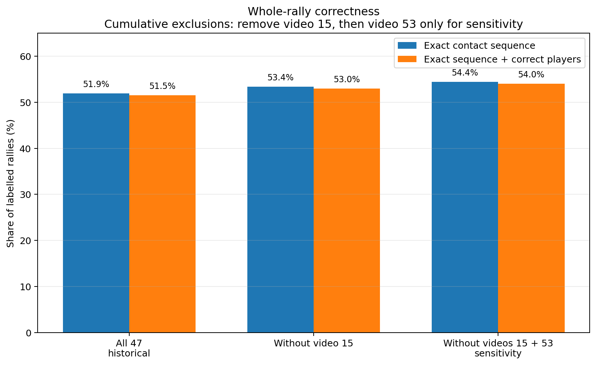
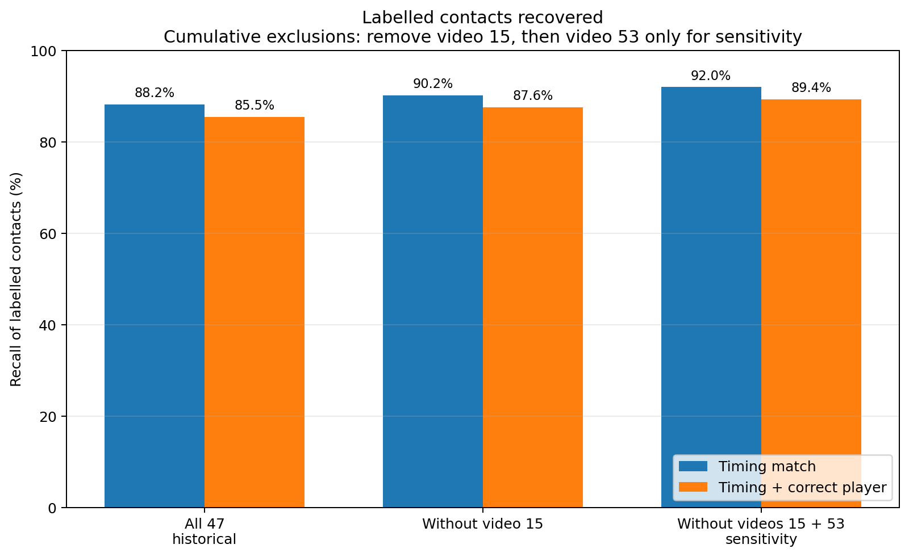
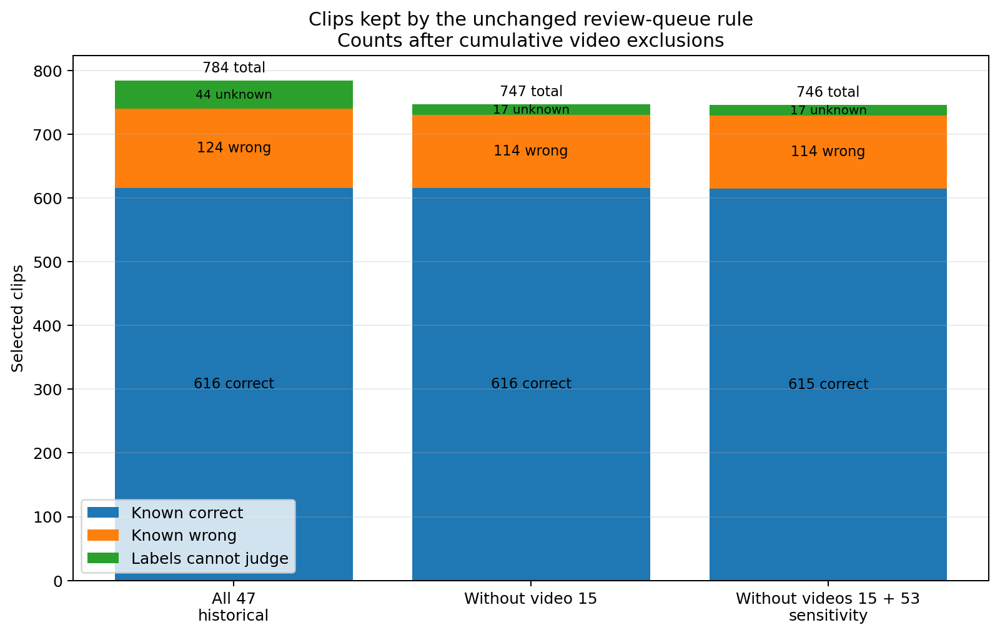
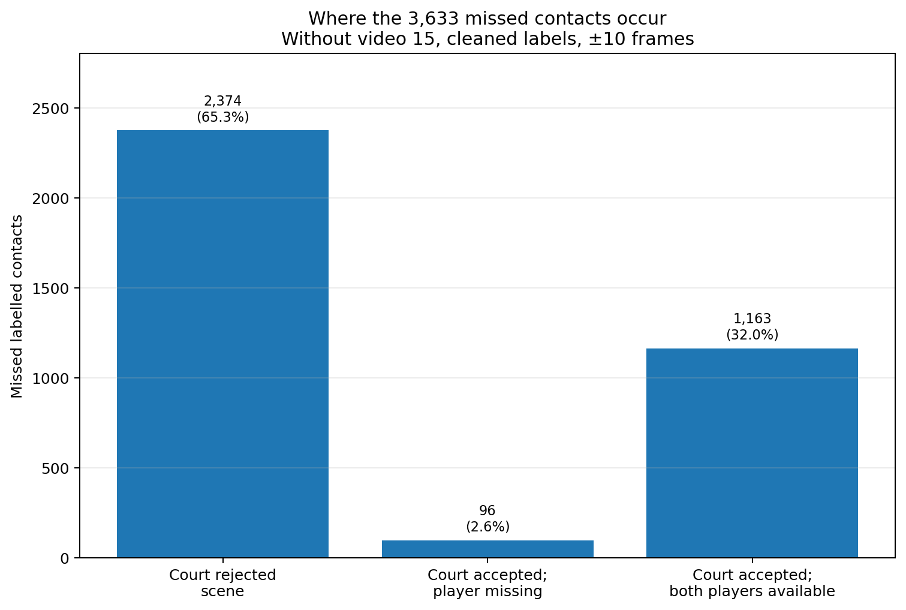

# Annotator failure investigation: what we found

**Fix the court stage before fitting another contact model.**

This branch evaluates the finished annotator on the saved ShuttleSet22 outputs and tries to explain where its errors come from. The aim is not just to produce another accuracy number, but to separate failures caused by bad labels, court rejection, missing player inputs, contact selection, and rally boundaries. The detector itself stays fixed while we trace errors back through the saved pipeline state and check representative cases against the footage.

Without the bad labels from ShuttleSet22 video 15, the saved learned annotator misses 3,633 labelled contacts. The court check blocks **2,374 of them (65.3%)** before normal contact scoring. We found usable live play among those rejected scenes and reproduced two concrete failures: OpenCV wrecks a court outline in video 53, while the shared outline loses a visible player in video 17.

Video 15 is a separate problem. Its labels point to the wrong parts of the match, including rallies that appear to match the detector only by coincidence. Drop that video and its derived release records rather than repairing it. Video 53 should stay: direct checks support its labels, and its poor score exposes the court failure instead of bad ground truth.

The learned path is still useful. On the 46 videos left after removing video 15, it produces **1,763 / 3,327 fully correct rallies (53.0%)**. The ordinary heuristic produces **4 / 3,327 (0.12%)**. The fixed confidence ranking keeps **747 clips**: 616 known correct, 114 known wrong and 17 the labels cannot judge. Among judgeable clips, exact-annotation precision is **84.4%**. That is a good bootstrap for review and fixup, not hands-off ground truth.

The numbers below describe the saved run. Rerun them after #147 removes video 15 from the release and #148 changes the court stage.

**Contents**  
[Results at a glance](#results-at-a-glance)  
[Video 15 and the next benchmark](#video-15-and-the-next-benchmark)  
[Why court handling comes first](#why-court-handling-comes-first)  
[What the learned path improved](#what-the-learned-path-improved)  
[What still fails](#what-still-fails)  
[Dead ends](#dead-ends)  
[What remains](#what-remains)  
[Reading guide](#reading-guide)  
[Limits](#limits)

## Results at a glance

The same saved learned output is shown under three cumulative video populations. Removing a video changes the denominator; it does not repair the output.

| Saved learned output, cleaned labels, ±10 frames | All 47: historical | Without video 15 | Without videos 15 and 53: sensitivity |
|---|---:|---:|---:|
| Labelled rallies | 3,422 | **3,327** | 3,251 |
| Labelled contacts | 38,218 | **37,184** | 36,247 |
| Exact whole-rally contact sequence | 1,777 (51.9%) | **1,777 (53.4%)** | 1,770 (54.4%) |
| Fully correct rally, including players | 1,763 (51.5%) | **1,763 (53.0%)** | 1,756 (54.0%) |
| Contact timing match | 33,716 (88.2%) | **33,551 (90.2%)** | 33,356 (92.0%) |
| Contact timing + correct player | 32,667 (85.5%) | **32,586 (87.6%)** | 32,392 (89.4%) |
| Serve timing + correct player | 2,647 (77.4%) | **2,642 (79.4%)** | 2,628 (80.8%) |

Keep video 53 in the main read. Removing it is only a sensitivity check: it removes seven fully correct rallies as well as many failures.

The fixed selection rule leaves this 46-video review queue:

| Selected clips | Count |
|---|---:|
| Known correct | **616** |
| Known wrong | 114 |
| Labels cannot judge | 17 |
| **Total** | **747** |

Among the 730 judgeable clips, exact-annotation precision is **616 / 730 = 84.4%**. Recall is **616 / 3,327 = 18.5%**, giving **30.4% F1**. Counting the 17 unknown clips as not proven correct gives **616 / 747 = 82.5%**.

Compact tables and definitions: [evaluation_tables.md](evaluation_tables.md).

## Video 15 and the next benchmark

ShuttleSet22 video 15 is not usable for evaluation. Its first labelled serve lands on opening graphics; later labels name a different game or score from the footage. Even its two complete timing matches show another rally on screen.

The decision is to exclude the video and its derived release records. [Issue #147](https://github.com/ahalp90/badminton_cv_annotator/issues/147) tracks that removal and the wider search for similar source failures.

A later direct review of 24 randomly sampled missed labels found:

- 16 where the visible hit and player agree with the label;
- three clear footage disagreements, all in video 15;
- one wrong-timing label in video 12;
- four unclear cases.

All four directly checked video 53 misses support the labelled hit and player. A poor detector score by itself is not a reason to exclude a video.

The release is also larger than this evaluation. The detector work covers 47 ShuttleSet22 videos; [issue #133](https://github.com/ahalp90/badminton_cv_annotator/issues/133) lists **40 original ShuttleSet videos and 58 ShuttleSet22 videos** for release. Original ShuttleSet already has first-stroke timing concerns in [issue #77](https://github.com/ahalp90/badminton_cv_annotator/issues/77).

## Why court handling comes first

Outside video 15, the learned output misses **3,633** labelled contacts:

| State at the labelled frame | Missed contacts |
|---|---:|
| Court rejected the scene | **2,374** |
| Court accepted; at least one player pick missing | 96 |
| Court accepted; both players picked | 1,163 |

Two failures were reproduced:

- **Video 53:** OpenCV replaces a plausible low-confidence corner with a point near the wrong end of the image. The broken outline fails the two-player check, so the scene never reaches normal player tracking or contact scoring.
- **Video 17:** the scene's own neural-net outline is usable, but the later shared outline is too small for that camera view. It moves the far player beyond the picker's allowed distance. Changing only the outline restores the player in both checked failures.

We have not yet run a fixed court pipeline end to end, so we do not know how many contacts or full rallies #148 will recover. See [court_failures.md](court_failures.md).

## What the learned path improved

The ordinary heuristic finds many plausible contacts but almost never gets a whole rally exactly right. Removing video 15 changes only its denominator:

- ordinary heuristic: **4 / 3,327 = 0.12%** fully correct rallies;
- learned output: **1,763 / 3,327 = 53.0%**.

Outside video 15, the two outputs overlap but are not nested:

| Same labelled contact | Contacts |
|---|---:|
| Both outputs find it | 28,351 |
| Learned output only | 5,200 |
| Ordinary heuristic only | 660 |
| Neither | 2,973 |

The learned path removes a lot of error once usable inputs exist. That leaves the shared court stage as a much larger fraction of the remaining misses. See [heuristic_comparison.md](heuristic_comparison.md).

## What still fails

Court handling is the biggest upstream problem, not the only one.

There are still **1,163 missed contacts** outside video 15 where the court is accepted and both players are available. Across all court-accepted contacts, including cases with a missing player pick:

- serves: 253 / 2,804 missed (9.0%);
- middle contacts: 663 / 28,704 missed (2.3%);
- final contacts: 343 / 3,062 missed (11.2%).

The 114 known-wrong selected clips contain 85 extra events and 67 missed labelled events. More than half of the extras come after the final label, but earlier deletion experiments showed that position alone is not enough to decide whether a physical hit is false.

Matched contacts are usually close: outside video 15, 83.6% are within two frames and 98.0% within five. The main residual problem is therefore missing or structurally wrong events, not a broad timing shift.

See [output_errors.md](output_errors.md) and [video_checks.md](video_checks.md).

## Dead ends

The final cheap detector tweaks did not improve the finished system:

- **Independent edge padding:** changed two of 3,982 proposals and repaired none.
- **Correcting chooser targets for post-padding success:** improved development output but changed the 47-video result **1,763 → 1,761**, with 21 repairs and 23 losses. It also broke two selected clips and repaired none there.
- **Label-guided one-edit repairs:** 58 of 119 wrong selected development clips have a complete one-edit alternative, but labels choose those repairs after the fact and every correct clip also has damaging alternatives.
- **Broad endpoint deletion:** no reliable signal separates false tail events from real contacts.
- **Repairing video 15:** abandoned in favour of exclusion.

Details and receipts: [last_followups.md](last_followups.md).

## What remains

1. **Fix #148 and rerun.** Use the reproduced video 53 and video 17 failures as regression cases, then measure contacts, serves, full rallies and review-queue quality across the evaluation.
2. **Apply #147 and check the release for other bad pairings.** Reuse saved frames and labels; stop once each video's keep/exclude decision is clear.
3. **Cover the full release inventory.** Original ShuttleSet still needs direct checks, and eight original videos need final chooser input preparation if a like-for-like detector comparison is still useful.
4. **Then return to the 1,163 good-input misses.** Work out whether the remaining errors come from missing candidates, bad sequence choices, boundaries or labels before fitting another model.

Noise-aware training can wait until there is a small directly checked contact set to judge it against.

Live backlog: [promising_leads.md](promising_leads.md).

## Reading guide

For most readers:

1. **This README** — conclusions and headline numbers.
2. [evaluation_tables.md](evaluation_tables.md) — compact numbers and recount command.
3. [output_errors.md](output_errors.md) — contact, rally and selected-clip failures.
4. [court_failures.md](court_failures.md) — reproduced court failures and the rerun target.
5. [video_checks.md](video_checks.md) — video 15, video 53, weak-video checks and original-ShuttleSet status.
6. [heuristic_comparison.md](heuristic_comparison.md) — ordinary heuristic versus learned output.
7. [label_accounting.md](label_accounting.md) — historical/all-source/±5 accounting.
8. [experiment_lineage.md](experiment_lineage.md) — what was actually checked.
9. [last_followups.md](last_followups.md) — closed detector ideas.
10. [promising_leads.md](promising_leads.md) — live questions only.

Saved-file pointers, full commands and validation receipts: [evaluation_reproduction.md](evaluation_reproduction.md).

## Limits

These are saved outputs on footage that had already been examined, not an untouched test of new matches.

The footage checks are samples. Scoreboard agreement can rule out a gross wrong-rally mismatch but cannot prove exact hit timing or player identity. The 24-contact direct review is stronger for those events, but it was sampled from misses rather than the whole collection.

The court substitutions prove the two mechanisms on the checked cases. Only an end-to-end rerun can show how much #148 improves the final annotator.
