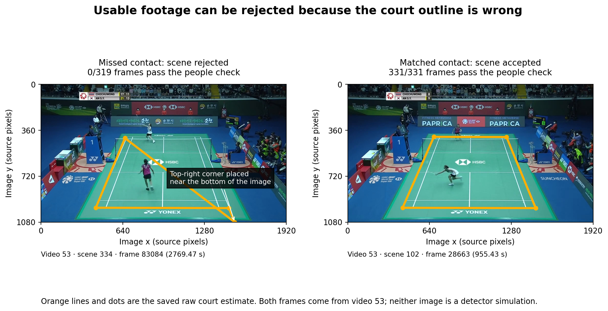
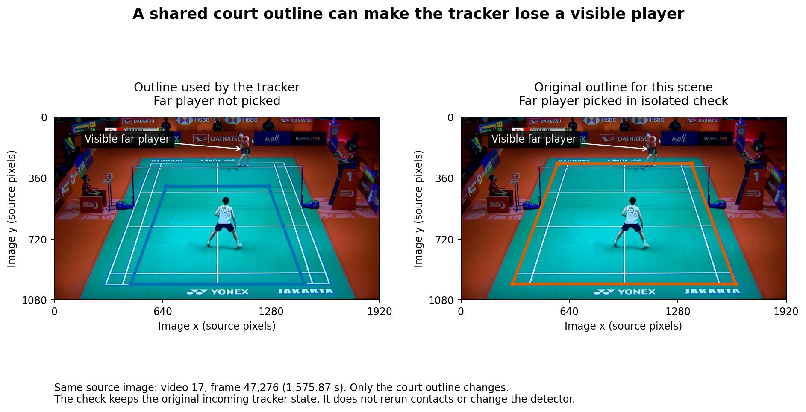

# Where the final annotator succeeds and fails

The fixed annotator produces a useful review queue, but the clips still need human
review before they can support player-performance records. Across 47 previously examined
videos, its selection keeps 784 clips: 616 are fully correct, 124 are wrong, and 44 remain
unknown. These counts use cleaned labels and allow ±10 frames for contact timing.

Many missed contacts never reach contact scoring because the court stage rejects
their scenes. The visual checks found ordinary live play among those rejected scenes.
One video's labels also refer to different footage, which makes its error counts
unreliable.

This evaluation asked where the finished annotator fails and whether its inputs explain
those failures. It checked saved results from already examined footage. The detector
and its selection rule stayed fixed. No model was trained or adopted.

For the later questions about excluding videos 15 and 53, how far the footage checks
went, and what is still open, read [the follow-up answers](VIDEO_CHECKS.md). This
overview keeps the original investigation's sample counts.

## What these results cover

The saved detector proposes 3,982 rally clips across 47 previously examined
ShuttleSet22 videos. It uses the existing local contact chooser, followed by padding
that extends clip edges without changing which contacts belong to each clip.
This remains an experimental script path; production integration is separate.

The main scores use the previously cleaned labels: 3,422 rallies containing 38,218
contacts. Earlier reports call these **trusted labels**. The broader check uses all
3,965 source rallies and 43,159 contacts. The separate 32-video development set is
outside this evaluation.

A fully correct clip contains one whole labelled rally, matches every contact once,
adds no unmatched contact, and names the correct player. The main timing allowance is
±10 frames on a 30 fps clock, about a third of a second. The tighter check uses ±5
frames. All 47 source videos are 30 fps.

The recount reproduced the previous results under both label sets and both timing
allowances. The videos had already been examined, so these results do not establish how well
the detector will work on new matches.

## One video's labels point to the wrong footage

**Video 15, An Se Young versus Akane Yamaguchi at the 2022 Uber Cup semi-final, has
confirmed timing and rally-identity disagreements.** This problem survived the earlier
label cleaning.

- The first labelled serve is at frame 186, or 6.20 seconds. The downloaded video is
  showing its opening graphics.
- At frame 45,575, the label says second game, rally 16. The footage is a replay with
  an arena score of 17–11. The source row records 8–8.
- Frame 97,748 falls within the labels for third-game rally 23, whose source score is
  12–11. The visible arena display shows the third game at 0–0.

The detector has zero fully correct rallies against this video's 95 cleaned rally
labels. That number cannot tell us how well it annotated the actual match. Even a
nearby timing match can pair contacts from different rallies by coincidence.

Video 15 contributes 27 of the 44 unknown selected clips and nine of the twelve
selected clips with more than one extra contact. Some apparently enormous contact
errors therefore come from comparing the output with the wrong part of the match.

The original 47-video counts remain below so they can be compared with earlier work.
For the court and player checks below, video 15 is left out. The labels and saved scores were not changed. The
[recorded checks](results/label_alignment_checks.csv.gz) preserve the relevant frames.

## What the fixed selection keeps

Before selection, 1,763 of the 3,422 cleaned rallies have a fully correct clip (51.5%).
Using all source rallies gives 1,763 of 3,965 (44.5%).

The selection chooses 784 of the 3,982 proposed clips. Against the cleaned labels,
**616 are correct, 124 are wrong and 44 remain unknown**.

That is 78.6% known correct across all selected clips. Among the 740 clips that can be
judged, 83.2% are correct. Both numbers matter: removing the unknowns from the denominator
does not resolve them.

The selection also rejects 1,147 correct clips. It retains 616 of the detector's 1,763
correct clips, or 34.9%. Those retained clips cover 18.0% of the 3,422 labelled rallies.
The current output is therefore a useful review queue, with considerable useful work
still left behind.

| Timing allowance | Cleaned labels: correct / wrong / unknown | All source labels: correct / wrong / unknown |
|---|---:|---:|
| ±10 frames | 616 / 124 / 44 | 615 / 140 / 29 |
| ±5 frames | 549 / 191 / 44 | 549 / 207 / 28 |

Each row describes the same 784 selected clips. Using all source labels settles some
unknown cases, but it does not remove the video 15 mismatch.

The existing review of the 44 unknown selections found 39 live-play clips, four mixes
of replay and live footage, and one apparent warm-up. That review checked broad footage
and clip edges. It did not establish the exact contact sequence.
[Earlier visual notes](../contact_det_closing_pass/results/selected_clip_review.csv)
remain the source for those judgements.

## What goes wrong inside selected clips

Most known errors concern the contact sequence. Of the 124 wrong selected clips:

| Observed problem | Clips affected |
|---|---:|
| Extra contacts | 92 |
| Missing contacts | 74 |
| Wrong player on a matched contact | 10 |
| Clip cuts off part of the labelled rally | 12 |

A clip can appear in several rows. None fails solely because of player assignment.
The [error-combination figure](figures/selected_errors.png) shows which problems occur
together.

Eighty of the 92 clips with extras have just one extra contact. Setting video 15 aside,
the 114 remaining wrong selections contain 85 extra events. Fifty-two of those events
fall after the final labelled contact. These are useful cases for checking rally ends,
but an event outside labelled support is not automatically a physically false hit.
The earlier endpoint-deletion work already found that unsupported events could not
be labelled reliably from the existing tables.

Rally length gives a weaker explanation than expected. Across all 3,422 cleaned rallies:

| Rally length | Fully correct rallies | Rate |
|---|---:|---:|
| 1–5 contacts | 517/989 | 52.3% |
| 6–10 contacts | 536/1,039 | 51.6% |
| 11–20 contacts | 505/967 | 52.2% |
| More than 20 contacts | 205/427 | 48.0% |

These denominators include rallies without a useful proposed clip.
Length alone does not explain most of the variation.

## The court stage blocks many missed contacts

For this section, video 15 is omitted. The remaining 46 videos contain 37,184 cleaned
contact labels. The final output matches 33,551 and misses 3,633 at ±10 frames.

**2,374 of those 3,633 misses, or 65.3%, fall in scenes the court stage rejected.**
At 2,277 of those missed times, no scored candidate exists within ±10 frames.
Removing the other unusually poor video, video 53, still leaves 1,640 of 2,891 misses
in rejected scenes: 56.7%.

The court stage first estimates the court outline. It uses that outline to check
whether exactly two detected people are standing on the court. A scene passes only
when at least half its frames pass that check. The decision then applies to every
frame in the scene.

Rejected scenes do not receive normal player tracking. They are also excluded from
the usual contact search. A later contact chooser cannot select a candidate that was
never made available.

This explains the pipeline route, but it does not establish whether each rejection
was sensible. A close-up, a replay and a badly estimated court can all produce a
rejection. The saved mask named `raw_replay_mask` is an algorithm's decision, not a
human judgement that the footage is a replay.

### Some rejected scenes show ordinary live play

The initial visual sample contains eight missed contacts and eight successful contacts
from the same videos. Four missed examples were deliberately drawn from court-rejected
scenes in videos 12, 20, 21 and 53. The other four came from accepted scenes.

A reader who did not see the detector outcomes found the whole court and both players
visible at all sixteen centre frames. All four court-rejected examples show an ongoing
exchange. Their successful controls also show usable court footage.

This is a small sample chosen to investigate errors. It demonstrates real false
rejections; it does not estimate their frequency across the collection.

In video 53, one rejected scene places the court's top-right corner near the bottom
of the image. That corner came from the OpenCV fallback. The saved record calls
this the “raw” outline, meaning before the shared-outline step; it is already a mix
of neural-net and OpenCV corners. Its people-on-court check passes in zero frames. A successful scene from
the same video has a sensible outline and passes throughout.

The source code explains why later geometry correction does not rescue the rejected
scene. Only scenes that already pass the people check enter the step that compares
court outlines across the video. A rejected outline is therefore excluded before that
step can correct it.

A small follow-up recomputed the saved people check in these four rejected scenes and
four successful controls. The original calculations matched the saved votes exactly.
The alternative used the existing shared outline estimated from that video's accepted
scenes. Changing only the outline gave these results:

| Rejected example | Frames with exactly two people: original outline | Same frames: shared outline |
|---|---:|---:|
| Video 12 | 1/377 (0.3%) | 368/377 (97.6%) |
| Video 20 | 0/1,029 (0.0%) | 906/1,029 (88.0%) |
| Video 21 | 716/4,031 (17.8%) | 1,973/4,031 (48.9%) |
| Video 53 | 0/319 (0.0%) | 315/319 (98.7%) |

The four successful controls were unchanged. Three rejected scenes would pass the
existing 50% people-check threshold with that outline; video 21 would still fail.
This shows that a bad court outline can cause usable scenes to be rejected. It does not measure repaired
contacts or rallies, and the detector's actual inputs and outputs remain unchanged.

## When the inputs are available, contact errors remain

Among the 1,259 missed contacts in court-accepted scenes outside video 15, every one
has saved features and nearby scored candidates. Both players were picked at 1,163
of those times. Available players and candidate rows therefore do not guarantee that
the final sequence includes the correct contact.

Player picks are missing at 96 of those 1,259 missed times, compared with 44 of 33,311
matched times in accepted scenes. Eighty of the 96 cases come from video 17.
The two inspected examples from that video show both physical players clearly,
although the saved features have no far-player pick.

Rerunning the original player tracker over video 17 reproduced both player-availability
fields at all 91,970 saved feature rows. It preserved the original settings and resets.
At the two failed examples, the tracker used a shared court outline that placed the
far player's projected position beyond its allowed distance from the expected position.
The person had been detected, but the player picker rejected them.

The original outline for that scene came from four confident neural-net corners.
OpenCV was not used there. The shared-outline step replaced that outline with a
smaller one, and the player picker received that smaller outline. The
[numbered comparison pictures](COURT_ISSUE.md) show both court failures step by step.

Changing only the outline to that scene's original estimate restored the far-player
pick at both inspected contact times. The calculation kept the actual incoming tracker
state and did not carry the alternative result into later frames. Both successful
comparison centres kept their original picks. Checks half a second and one second
either side also showed that the missing pick was intermittent.

This identifies another way court geometry affects the inputs. An outline shared
across a video can help one view and fit another view poorly. These checks establish
player-pick changes at sampled frames, not repaired contact sequences or rallies.

The filled shuttle track reports a visible shuttle at 3,514 of the 3,633 missed times
outside video 15. That only means a coordinate is available. The opening graphic in
video 15 also has a filled coordinate, so this flag cannot establish tracking accuracy.

### Starts and finishes are still harder

The figure preserves the full 47-video score. Restricting the check to accepted court
scenes outside video 15 gives the same ordering at ±10 frames:

- 253 of 2,804 serves missed (9.0%).
- 663 of 28,704 middle contacts missed (2.3%).
- 343 of 3,062 final contacts missed (11.2%).

Tightening the allowance particularly affects serves.

Scene transitions matter, but their saved locations are imperfect. One successful
control changes from a close-up to the court within the inspected four-second window,
even though the nearest saved cut is 11.6 seconds away. A plot based only on stored cuts
would miss that transition.

## What this suggests doing next

1. **Exclude ShuttleSet22 video 15 from use and from the released extracts.** The
   decision is to drop this video rather than repair its labels. [Issue #147](https://github.com/ahalp90/badminton_cv_annotator/issues/147)
   covers the removal and an efficient label check across both datasets. Keep the
   current counts as the historical reference.
2. **Investigate court geometry and scene rejection before another contact-model fit.**
   The footage shows visible match play being rejected before contact scoring.
   A useful follow-up should check both rescued scenes and newly admitted non-play
   footage.
3. **Keep human review in the dataset workflow.** The fixed selection still admits
   known errors and unknown cases. Correct player-performance records require reliable
   rally boundaries and contact sequences, not just a high contact-matching rate.

This evaluation does not establish how many rallies a court-stage change would repair.
It also does not settle exact hits outside the source labels, physical player-identity
swaps, or shuttle-coordinate accuracy across the videos. The recent rejected detector
experiments remain rejected; their results are in
[the preceding report](../contact_det_closing_pass/last_followups.md).

## Records and checks

The [scripts and result guide](README.md) identifies the saved baseline, tables,
sampling method and reproduction commands. The [per-video figure](figures/video_variation.png)
and [per-video table](results/per_video.csv.gz) retain the broader variation.

The recount reproduced both label populations and tolerances. Joins preserved source
frames, video IDs and individual label rows when timestamps repeated. Real-data runs,
scoped lint and meaningful array checks passed. The detector, selection identities and
source artefacts remained fixed.
