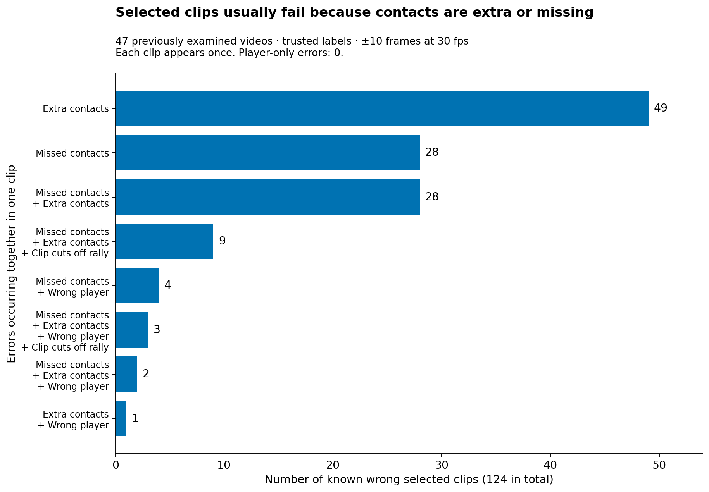
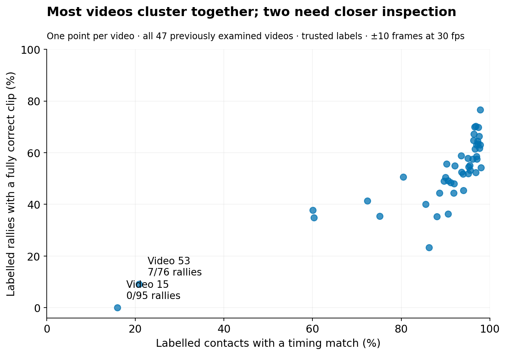

# More detail on the annotator’s results

The annotator finds useful match sequences, but a reliable player-performance dataset
still needs human review. The main problems are missed or extra contacts, footage
rejected by the court check, and a confirmed disagreement between one video's labels and
its downloaded frames.

This expanded report asks what the saved results can tell us about those problems. It
adds detail that would have made [the short report](REPORT.md) harder to use. The
measurements use the same fixed detector and the previously examined collection of 47
videos. The detector, labels and rule for keeping clips stayed the same.

The later [video checks](VIDEO_CHECKS.md) are a separate follow-up. They add charts with
videos 15 and 53 left out, direct game-and-score checks for video 53 and other weak
videos, and a random sample of missed contacts. They also address the training and
original-ShuttleSet questions. The [per-video viewer](VIDEO_BREAKDOWN.html) shows
individual results.

## Find the question you need

- [What exactly counts as success?](#what-exactly-counts-as-success)
- [How much error comes from labels pointing to the wrong video time?](#how-much-error-comes-from-labels-pointing-to-the-wrong-video-time)
- [Was any of video 15 actually fine?](#was-any-of-video-15-actually-fine)
- [Are the contacts mistimed, or missing altogether?](#are-the-contacts-mistimed-or-missing-altogether)
- [How often is the player wrong?](#how-often-is-the-player-wrong)
- [Do all rallies get a usable proposed clip?](#do-all-rallies-get-a-usable-proposed-clip)
- [What useful output does selection leave behind?](#what-useful-output-does-selection-leave-behind)
- [What changes when all source labels are used?](#what-changes-when-all-source-labels-are-used)
- [How large are the errors inside selected clips?](#how-large-are-the-errors-inside-selected-clips)
- [Which videos need a different explanation?](#which-videos-need-a-different-explanation)
- [What happens before contact scoring?](#what-happens-before-contact-scoring)
- [Can a clearly visible player still be lost?](#can-a-clearly-visible-player-still-be-lost)
- [What did the footage checks establish?](#what-did-the-footage-checks-establish)
- [What remains worth investigating?](#what-remains-worth-investigating)

## What exactly counts as success?

The saved system proposes 3,982 rally clips from the 47 previously examined videos. A
clip succeeds only when it contains one whole labelled rally, matches every labelled
contact once, adds no unmatched contact, and assigns the right player. The primary
timing allowance is ±10 frames at 30 fps, or about one third of a second. The secondary
allowance is ±5 frames.

The main, cleaned label set contains 3,422 rallies and 38,218 contacts. Earlier reports
call these labels “trusted”. The broader source-label check contains 3,965 rallies and
43,159 contacts. Cleaning did not remove every source problem: video 15's labels still
disagree with the downloaded footage.

The 32-video development collection is separate. These results describe footage that has
already been examined repeatedly, so they do not establish performance on new matches.

The detector first produces clips and their contact lists. A separate rule keeps some
clips for review. “Selected” means those kept clips, not all the detector output.

Three things are counted throughout the report:

- A **contact** records whether a hit appears at the right time and belongs to the right player
- A **labelled rally** records whether the system supplies a fully correct clip for that rally
- A **proposed clip** is one item in the saved output that could be used

A high contact-matching rate can coexist with many unusable clips. One extra or missing
hit is enough to break an otherwise good sequence.

Unknown means there are not enough labels to judge the clip. Unknown stays separate from
both correct and wrong. The scores do not count all the empty frames as correct answers;
doing that would make accuracy look high while hiding missed hits.

## How much error comes from labels pointing to the wrong video time?

Video 15 has a serious problem: its labels point to the wrong parts of the footage. We
still do not know what share of all apparent detector errors comes from bad labels. The
labels have not been corrected. To measure their effect, they would need to be matched
to the right footage and the output scored again.

The original investigation checked five short windows in video 15 and three in video 53.
It began with unusually poor scores, then compared each labelled game and rally with the
action and score visible in the downloaded footage. Video 15's first labelled serve
lands on opening graphics. Later windows show a different game or score. The video 53
pilot shows ordinary court footage and led to the separate court-geometry investigation.

This expanded report added five video 15 windows chosen for strong timing matches. The
set included both rallies where every cleaned contact had a timing match. All five
showed a clearly different game or score in the footage.

That makes ten targeted video 15 windows in total. They are not a review of all 95
cleaned rallies. The original middle and late checks, together with the five later
examples, reach across all three labelled games. The work did not inspect every event,
recover the annotation's original video edit, search a range of timestamp shifts, or
repair any labels. The other sixteen scene-control windows assessed view and visibility.
They were not a collection-wide check of label-to-rally identity.

The saved counts show how much of each reported error occurs in video 15:

| Reported outcome, cleaned labels at ±10 frames | Video 15 | All 47 videos | Share occurring in video 15 |
|---|---:|---:|---:|
| Missed labelled contacts, full-video matching | 869 | 4,502 | 19.3% |
| Emitted contacts without a label match | 2,092 | 7,889 | 26.5% |
| Labelled rallies without a fully correct clip | 95 | 1,659 | 5.7% |
| Known wrong selected clips | 10 | 124 | 8.1% |
| Extra events within wrong selected clips | 97 | 182 | 53.3% |
| Missed events within wrong selected clips | 118 | 185 | 63.8% |

For example, 869 means that 869 of the 4,502 missed labelled contacts occur in video 15.
It does not mean that the label mismatch caused all 869 misses.

These rows count different things and must not be added. Video 15 also contains 27 of
the 44 unknown selected clips, or 61.4%. Unknown clips sit outside the error rows.

Video 15 affects some summaries much more than others. It supplies more than half of the
event errors inside wrong selected clips, but only about one fifth of all missed
labelled contacts. It cannot explain the other 3,633 misses outside that video.

The shares in the table are not percentages proved to be caused by misalignment. Some
video 15 output may contain real detector errors. Other videos may also have label
problems that this evaluation has not found. Setting video 15 aside shows how the
summaries change without it. It does not produce a corrected estimate of detector
accuracy.

## Was any of video 15 actually fine?

The footage contains clear, usable match play. No inspected labelled section has been
confirmed to line up with the correct rally. These are separate questions.

The saved score finds 165 timing matches among 1,034 cleaned labels in video 15. That
number alone does not show that any section is aligned. In particular, the two rallies
with a timing match for every label still refer to the wrong part of the match:

| Labelled rally checked | Timing matches | Source-row game and score | Game and score visible in the video |
|---|---:|---|---|
| Game 2, rally 39 | 6/6 | Game 2, 21–18 | Game 2, 9–8 |
| Game 2, rally 7 | 2/2 | Game 2, 5–2 | Game 1, 13–5 |
| Game 1, rally 31 | 6/12 | Game 1, 13–18 | Game 1, 1–0 |
| Game 3, rally 30 | 4/5 | Game 3, 15–15 | Game 3, 5–2 |
| Game 2, rally 24 | 5/6 | Game 2, 10–14 | Game 2, 2–0 |

The table copies each source row's A/B score order. The visible score follows the
broadcast display's player order. The disagreements remain if that order is reversed, or
if the source score was recorded after the point rather than before it.

These five checks deliberately favour sections that look successful from their timing.
They therefore add evidence against using those matches as proof of alignment. They do
not prove that every remaining section is wrong, or that the detector failed on the
actual visible rally. The 6/6 example is visibly a normal exchange; the evaluation is
comparing it with another rally's labels.

Across video 15's saved proposed clips, none contains an exact complete labelled contact
sequence, even before player correctness is required. Because the labels are misaligned,
that result cannot establish that none of the detector's actual clips is correct. To
find a section we can trust, we would need to match it to the right rally and check the
contacts against the footage.

Those were the ten checks available when this expanded report was written. The later
[video checks](VIDEO_CHECKS.md#is-video-15-usable-for-evaluation) added four randomly
chosen misses in video 15: two game/score disagreements and two unreadable scoreboards.
No checked section has yet been shown to match the labelled rally. The footage has not
been fully relabelled. Exact requests and source rows remain in [the follow-up
table](results/video15_followup_labels.csv.gz), with observed scores in [the visual
findings](results/video15_followup_review.csv.gz).

## Are the contacts mistimed, or missing altogether?

Both happen, but tightening the timing allowance explains only part of the gap. Across
all 47 videos, the final stream emits 41,605 contacts. At ±10 frames it matches 33,716
of the 38,218 cleaned contact labels, or 88.2%. At ±5 frames it matches 32,972, or
86.3%. The tighter allowance removes 744 timing matches.

Of the 41,605 emitted events, 33,716 match a cleaned label, or 81.0%. The other 7,889
are unmatched against that label set. These are not all proven false detections. The
cleaned labels omit some rallies, and video 15 has a source mismatch. Using all source
labels matches 37,485 emitted events and leaves 4,120 unmatched.

For timing detail, set video 15 aside. The remaining 46 videos contain 33,551 timing
matches:

| Distance from the labelled frame | Matched contacts | Share of timing matches |
|---|---:|---:|
| Exactly the same frame | 9,012 | 26.9% |
| Within two frames | 28,035 | 83.6% |
| Within five frames | 32,878 | 98.0% |

The rows overlap. An exact match also falls within two and five frames. The median
offset is zero and the mean is about half a frame early. That small average does not
justify shifting the whole output because positive and negative errors can cancel.

This plot includes only contacts that already have a timing match. It cannot explain the
3,633 missing contacts outside video 15. It does show that many hits the detector finds
are already close to the labelled time.

Starts and finishes are harder than middle contacts. Across all 47 videos at ±10 frames,
the system matches 2,781/3,422 serves, 28,195/31,415 middle contacts, and 2,740/3,381
final contacts. The 41 one-contact rallies count as serves only.

The same ordering remains after removing video 15 and restricting the count to
court-accepted frames. The system misses 253/2,804 serves, or 9.0%; 663/28,704 middle
contacts, or 2.3%; and 343/3,062 final contacts, or 11.2%. The tighter allowance
particularly affects serves. The [contact-position figure](figures/contact_position.png)
shows both timing allowances.

## How often is the player wrong?

Most timing matches have the right player, but player assignment is not perfect. At ±10
frames, 33,715 matched contacts have a label saying which player hit the shuttle. Of
those, 32,667 have the correct side, or 96.9%.

Here, Top means the player on the far side of the image and Bot means the player on the
near side. These labels do not identify a particular athlete throughout the match. The
final output starts from its chosen first hitter and alternates the two players
throughout each rally. These are the player answers being scored below.

| Labelled player | Predicted far player | Predicted near player | No player assigned |
|---|---:|---:|---:|
| Far player | 16,183 | 410 | 0 |
| Near player | 632 | 16,484 | 6 |

One further timing match has no known player in its label, so it is outside this table.
There are 1,042 known side confusions and six unassigned predictions. Calling all 33,716
minus 32,667 cases “wrong player” would also count that unknown label.

This table checks near versus far at each matched hit. It does not check whether the
system keeps track of the same athlete throughout a match. A person’s number in a
frame’s detection list can change just because the list is reordered. That alone does
not prove the athletes were mixed up.

In the selected output, ten of the 124 known wrong clips include a wrong player on a
matched contact. Every one also contains another error. Fixing player assignment alone
therefore cannot make any of those 124 clips fully correct. There are no player-only
failures. Missing player inputs can still prevent a contact from appearing at all.

## Do all rallies get a usable proposed clip?

No. For 419 of the 3,422 cleaned rallies, no proposed clip contains every labelled
contact. Of those 419 rallies, 153 receive only partial coverage and 266 have no clip
that reaches any of their labelled contact times.

The complete breakdown is:

| Best available output for a labelled rally | Rallies |
|---|---:|
| Fully correct clip | 1,763 |
| At least one clip contains all labels, but no clip is fully correct | 1,240 |
| Some labelled contacts fall inside a clip, but no clip contains them all | 153 |
| No proposed clip reaches a labelled contact | 266 |

A clip can contain all labels and still contain contacts from another rally or have the
wrong sequence. Containment is therefore a necessary step, not success by itself. The
table describes available output; its rows are not independent failure causes.

This also explains why different containment counts appear in result tables. Here, 3,003
rallies fit inside at least one clip. The stricter proposal summary counts 2,817 rallies
contained by a clip that overlaps exactly one labelled rally. The difference comes from
the question being asked.

Removing video 15 leaves 3,327 rallies: 1,763 fully correct, 1,226 contained with
errors, 113 partially covered, and 225 without a clip reaching a label. Removing videos
15 and 53 leaves 169 such unreached rallies. The problem extends beyond those two
outliers.

## What useful output does selection leave behind?

The unchanged selection rule keeps 784 clips from the 3,982 proposals. At the primary
±10-frame allowance, the cleaned labels give 616 correct, 124 wrong, and 44 unknown
selected clips. The clips left out of the review queue include 1,147 correct, 1,153
wrong, and 898 unknown clips.

The rule keeps 616 of the 1,763 correct clips already available, or 34.9%. It makes the
review queue cleaner, but leaves many correct clips out. Before selection, 51.5% of the
3,422 cleaned rallies have a correct clip. The kept clips cover only 18.0%.

Of the 784 kept clips, 616 are correct: 78.6%. If the 44 unknown clips are set aside,
that becomes 616/740, or 83.2%. Setting them aside does not tell us whether they are
actually right or wrong.

This is the practical trade-off. The queue is shorter and more useful to review, while
many correct clips remain outside it. These results do not show how a new threshold
would move that trade-off on unseen footage. No threshold was retuned here.

Useful output is spread across the videos. For example:

| Video | Correct clips before selection | Correct selected | Wrong selected | Unknown selected |
|---|---:|---:|---:|---:|
| 33 | 66 | 29 | 3 | 0 |
| 52 | 56 | 28 | 5 | 1 |
| 41 | 59 | 23 | 4 | 0 |
| 47 | 54 | 23 | 6 | 0 |
| 15 | 0 | 0 | 10 | 27 |

These examples describe the saved queue. They are not a ranking of matches suitable for
future deployment. The [full per-video selection
table](results/selection_per_video.csv.gz) keeps every video's counts.

Video 15 supplies 37 selected clips, including 27 of the 44 unknown clips. This is
another reason to resolve its labels before using its failures to guide model work.

## What changes when all source labels are used?

The total stays at 1,763 fully correct clips, but they are not exactly the same clips.
Three clips that were correct under cleaned labels become wrong with all source labels.
Three previously unknown clips become correct. Equal totals hide those changes.

For the selected 784 clips, the change is:

| Judgement with cleaned labels | Judgement with all source labels | Selected clips |
|---|---|---:|
| Correct | Correct | 615 |
| Correct | Wrong | 1 |
| Wrong | Wrong | 124 |
| Unknown | Wrong | 15 |
| Unknown | Unknown | 29 |

Adding the source rows settles fifteen unknown selections as wrong. It also exposes one
contradiction in a previously correct clip. It does not turn an unknown selected clip
into a confirmed correct one. The kept clips change from 616 correct, 124 wrong and 44
unknown to 615 correct, 140 wrong and 29 unknown.

Across all proposals, 942 have no overlap with a cleaned rally. Another 71 overlap more
than one cleaned rally. The remaining 2,969 overlap exactly one. These distinctions
matter when interpreting “unknown” and clip-boundary failures.

The labels themselves can be wrong. The video 15 pilot found its first labelled serve on
opening graphics. Later scoreboard checks showed the wrong game and rally identity.
Those checks show the mismatch. They do not tell us whether one time shift would fix it
or exactly how the source video was edited. The short report shows the [comparison
frames](figures/label_alignment.png).

## How large are the errors inside selected clips?

At ±10 frames, the 124 wrong selected clips include 92 with extra contacts, 74 with
missing contacts, ten with a wrong matched player, and twelve that cut off part of the
labelled rally. These groups overlap.

The largest exclusive groups are 49 clips with extras alone, 28 with misses alone, and
28 with both. Nine have missing and extra contacts together with a cut-off rally. The
remaining combinations are smaller, as the figure shows.

Eighty of the 92 clips with extras contain exactly one extra event. The other twelve
contain between two and 26. Nine of those twelve come from video 15. When a clip appears
to contain many extra hits, first check that its labels refer to the right rally.

Set video 15 aside. The remaining 114 wrong selected clips contain 85 extra events and
67 missed labelled contacts:

| Event error | Position | Events |
|---|---|---:|
| Extra | Before the first labelled contact | 2 |
| Extra | Between the first and last labelled contacts | 31 |
| Extra | After the last labelled contact | 52 |
| Missed | Serve | 35 |
| Missed | Middle contact | 8 |
| Missed | Final contact | 24 |

These are event counts, not clip counts. They come from matching within each selected
clip. The earlier full-video contact table can match a nearby event outside the clip, so
the answers need not be identical.

The concentration near rally ends helps choose footage to inspect. It does not prove
that every event after the final label is a false physical hit. Earlier experiments
tried removing events near rally ends. The existing labels could not tell us reliably
whether those events should be removed. Those model changes were rejected, and this
evaluation gives no new reason to use them. Their outcomes are in [the earlier
report](../contact_det_closing_pass/last_followups.md).

## Which videos need a different explanation?

Performance varies considerably. If the 47 videos are ordered by contact-match rate, the
middle video scores 94.1%. If they are ordered by fully correct rally rate, the middle
scores 53.2%. These summaries give each video equal weight, regardless of its number of
contacts.

At the high end, video 41 has 59/77 fully correct rallies, or 76.6%. Videos 33 and 18
have 66/94, or 70.2%, and 42/60, or 70.0%. This shows that the pipeline can produce many
complete sequences in some matches. It does not establish why those matches are easier.

At the low end:

| Video | Fully correct rallies | Matched contacts | What the checks support |
|---|---:|---:|---|
| 15 | 0/95 | 165/1,034 | Labels and downloaded footage disagree |
| 53 | 7/76 | 195/937 | 734 of its 742 misses fall in court-rejected scenes |
| 17 | 17/73 | 842/976 | Missing player picks concentrate here; two inspected failures trace to court geometry |
| 20 | 15/43 | 324/537 | One sampled rejected scene has no raw court outline despite usable footage |
| 38 | 29/82 | 1,022/1,161 | No additional visual explanation established in this evaluation |

The original checks did not explain video 38’s score. A later sample found consistent
games and scores in three windows there, including a close-up followed by play, but
still did not explain the video as a whole. A low score tells us where to look; it does
not tell us the cause.

Removing video 15 raises fully correct rally coverage from 51.5% to 53.0%. Removing both
15 and 53 gives 54.0%. The main overall limitation remains after those outliers are
removed.

## What happens before contact scoring?

Outside video 15, the final stream misses 3,633 of the 37,184 cleaned contact labels.
Those labels divide as follows at their labelled frames:

| Input state | Labelled contacts | Matched | Missed | Share missed within this state |
|---|---:|---:|---:|---:|
| Court rejected | 2,614 | 240 | 2,374 | 90.8% |
| Court accepted; at least one player pick missing | 140 | 44 | 96 | 68.6% |
| Court accepted; both players picked | 34,430 | 33,267 | 1,163 | 3.4% |

The 90.8% in this table starts with all labelled hits in rejected scenes and asks how
many were missed. The short report’s 65.3% starts with all missed hits and asks how many
were in rejected scenes. Both describe the same saved results.

These stages depend on each other. First, the system estimates the court for the scene,
using the neural net and sometimes the OpenCV fallback. That estimate is called “raw” in
the saved files; it can already contain OpenCV corners.

Next, it checks for exactly two people inside the court and its allowed margin. At least
half of the scene’s frames must pass. Only scenes that pass reach the shared-outline
step. Rejected scenes skip normal player tracking and contact search, so one bad outline
can affect all those later steps.

At 2,277 of the 2,374 court-rejected misses, no scored row exists within ±10 frames. The
later model cannot choose a contact time it was never given.

A label can still match when its exact frame is rejected because the timing window can
reach a nearby available event. That is how the first row can contain 240 matches even
though the labelled frames were rejected.

At all 1,259 missed times in accepted scenes, exact saved features and nearby scored
candidates exist. For these cases, we need to check whether the inputs were accurate and
whether the model chose the right contacts. Having nearby candidates does not show that
any one of them was correct or could be added without making the rally worse elsewhere.

Four deliberately sampled rejected scenes showed the whole court, both players, and an
ongoing exchange. Recomputing their original votes reproduced every saved frame.
Changing only the outline to the existing shared outline made three pass the original
50% threshold. Video 21 rose from 17.8% to 48.9% and still failed. All four successful
controls retained their vote counts. This shows that changing the outline can let usable
play through. The test did not rerun contact detection, so it does not tell us how many
rallies would improve.

A bad initial scene outline can therefore reject usable play before any later outline
comparison or correction is reached.

## Can a clearly visible player still be lost?

Yes. Video 17 contributes 80 of the 96 missed contacts with missing player picks in
accepted scenes outside video 15. Both inspected failures show the far player clearly.

Rerunning the original tracker over all 213,154 frames used its original 38 tracking
segments and state resets. Both current-frame player-availability fields matched all
91,970 saved feature rows. The rerun agreed with the saved answers about whether each
player was available. It did not compare every other feature or every person’s
detection-list number.

The picker projects each detected person's foot position into court coordinates. It then
measures the distance to the expected player position, which combines a fixed court
location with recent tracking state. In the two failed examples, the shared court
outline puts the far player too far away in those coordinates.

| Sampled contact | Distance using shared outline | Distance using original scene outline | Allowed maximum |
|---|---:|---:|---:|
| Video 17, frame 47,276 | 0.706 | 0.280 | 0.600 |
| Video 17, frame 46,045 | 0.654 | 0.240 | 0.600 |

These distances use the tracker's normalised court coordinates, not image pixels. The
shared-outline distances, 0.706 and 0.654, exceed the 0.600 limit, so the saved picker
rejects both far-player picks. The per-scene outline gives 0.280 and 0.240, which pass.
Changing only the outline restores the far-player pick in both checks. The two successful comparison centres retain their picks, as do the frames
checked half a second and one second either side.

The calculation uses the actual incoming tracking state and never feeds the alternative
result into later frames. The alternative picks therefore do not change what the tracker
sees next. The surrounding frames also show that the missing pick comes and goes.
Neither finding measures contacts or rallies recovered by a full pipeline change.

The [side-by-side figure](figures/player_geometry.png) makes the mismatch visible. The
later [numbered pictures](COURT_ISSUE.md) also show where each corner moved. In these
video 17 examples, all four original corners came from the neural net. OpenCV was not
used in that scene. The shared-outline step replaced a better outline with the
undersized one actually sent to the player picker. Together with the rejected-scene
examples, it suggests a more precise follow-up than applying the shared outline to every
camera view: check whether the outline fits each view.

## What did the footage checks establish?

The table brings together the separate batches described earlier. Each row lists a
new batch of checks.

| Batch | Windows checked | Main question |
|---|---:|---|
| Initial checks of videos 15 and 53 | 8: five in video 15, three in video 53 | Does the footage show the expected match action? |
| Extra checks of strong timing matches in video 15 | 5 | Do apparently good timing matches name the right rally? |
| Missed contacts and successful comparisons | 16: eight misses, eight successes | Were the court and players visible? |
| Later follow-up in VIDEO_CHECKS.md | 53 across 19 videos | Do the game and score agree with the labels? |

The original pilot inspected eight targeted times in videos 15 and 53. It tested whether
unusually bad scores referred to the expected match action. It exposed the video 15
disagreement. The inspected video 53 serve examples showed ordinary court footage, so
that video needed a different explanation.

The expanded report then added five video 15 windows chosen for strong timing matches.
Those are the five windows described above and bring the targeted video 15 total to ten.
They do not replace the original pilot's counts.

A second sample used eight missed middle contacts and eight successful controls from the
same videos. Four misses came from rejected scenes, two from accepted scenes with a
missing player pick, and two from accepted scenes with both picks. Controls came from
fully correct rallies, using the closest rally length and then time.

The sampling seed was fixed at 20260906. Random IDs hid detector outcome and input state
from the scene reader. Each request showed nine frames at half-second intervals across
±2 seconds. All sixteen centre frames showed the whole court and both players. The broad
observations and exact requests remain in the [visual
review](results/visual_review.csv.gz) and [sample table](results/visual_sample.csv.gz).

This sample deliberately contains many failures. It demonstrates that usable footage can
be rejected; it cannot estimate the collection-wide false-rejection rate. Sparse stills
also cannot confirm exact racket contacts or playback speed. Camera view and likely live
or replay status were recorded separately.

All sample centres were more than two seconds from a saved scene cut. Nevertheless, one
successful control visibly changes from a close-up to the court within its four-second
window. Its nearest saved cut is 11.6 seconds away. Saved scene boundaries are
incomplete evidence of actual camera changes.

The later [video checks](VIDEO_CHECKS.md) added 53 windows across 19 ShuttleSet22
videos. All nine video 53 checks and all three checks in each of seven other weak videos
had games and scores consistent with their labels.

Of 24 randomly chosen misses, twenty had consistent games and scores, two disagreed and
two were unreadable. The latter four all came from video 15. These checks can find
labels pointing to the wrong rally; they do not settle exact hit times or player labels.
They are additional to the initial eight missed contacts and eight successful
comparisons above. No full original-ShuttleSet replay was run.

The existing 44-clip unknown review answers another question. It found 39 live-play
clips, four mixtures, and one apparent warm-up. It did not check the exact contacts.
Reusing that review does not add new independent observations.

Finally, shuttle availability is not shuttle accuracy. A filled coordinate exists at
3,514 of the 3,633 missed times outside video 15. The opening graphic in video 15 also
has a filled coordinate. This flag says that an input is present. It does not show that
the input follows the physical shuttle.

## What remains worth investigating?

Exclude ShuttleSet22 video 15 from use and from the released extracts. Its labels
point to the wrong footage, and the decision is to drop this video. Label repair is
no longer planned. [Issue #147](https://github.com/ahalp90/badminton_cv_annotator/issues/147)
records the exclusion work and an efficient check of both datasets for other
unreliable labels. The scores above remain the historical reference.

Then investigate court geometry before another contact-model fit. The evidence
identifies two distinct problems. A poor per-scene outline can reject useful scenes. A
shared outline can fit another camera view poorly and lose a visible player. When
testing a fix, check both sides: does it let more real play through, and does it also
let through footage that should be skipped?

After that, revisit contact sequences where the court is accepted and both players are
available. There are still 1,163 missed labelled contacts in that group outside video
15. Starts, ends, and unsupported extra events offer concrete cases for review, but the
existing labels do not settle every physical hit.

Human review remains necessary for player-performance records. The present selection
improves the review queue while leaving many correct clips behind. These results do not
show that the output can be used without checking. No detector fix was made or tested
across the full pipeline.

The [data and script guide](README.md) records how the tables were produced.
`results/extended_summary.json.gz` holds the added totals. The CSV tables keep the
player mistakes, changes when a different label set is used, per-video clip selection,
and missed-hit rates for each court/player input state. They all use the same saved
evaluation records.
