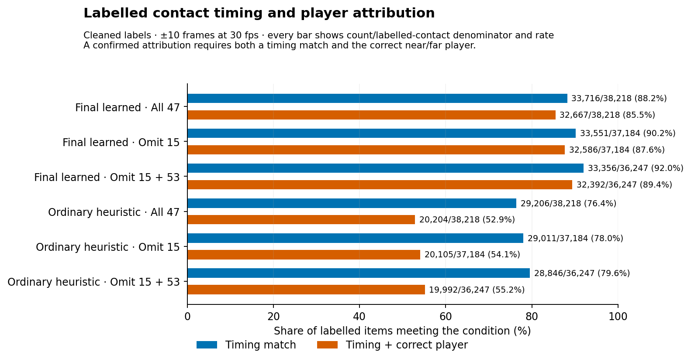
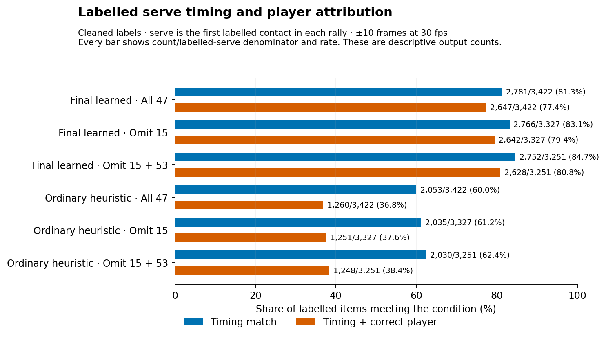
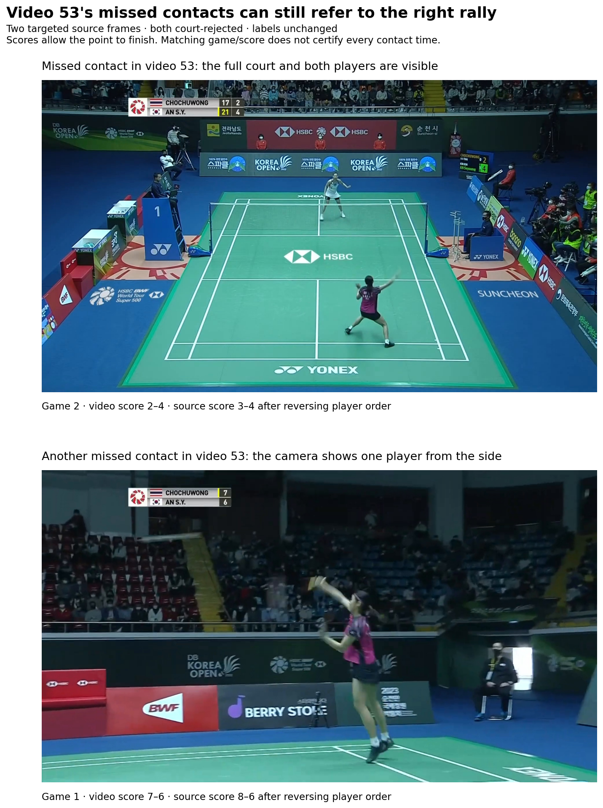

# What changes without videos 15 and 53?

Keep video 53 in the main evaluation. Video 15's labels point to the wrong parts of the
footage, so its current scores cannot reliably tell us how well the detector works.

The comparison uses saved outputs from 47 previously examined ShuttleSet22 videos, the
current cleaned labels, and a timing allowance of ±10 frames at 30 frames per second. No
detector was retrained or changed. A fully correct rally needs every labelled hit at
the right time, with the right player, and no extra hits.

Removing both videos raises the share of fully correct rallies from 51.5% to 54.0%.
Contact matches that also identify the hitting player rise from 85.5% to 89.4%. These
percentages change because the denominator becomes smaller; removing a video does not
repair any saved output.

Video 15 and video 53 need different explanations. Video 15's labels point to the wrong
parts of the match. New game-and-score checks agree with video 53's labels, although its
court stage rejects many scenes. Keeping video 53 shows how much that difficult case
affects the result. The comparison without it checks how the percentages change when
that case is left out.

## How far the work went

The score comparisons cover all 47 saved ShuttleSet22 videos. The footage checks cover
53 short windows from 19 of those videos. Original ShuttleSet is a separate collection;
its section below explains what would be needed to run the same comparison there.

The work found specific court failures, but it has not explained every failure or
measured what share comes from wrong labels.

| Question | What was done | What is still open |
|---|---|---|
| Results without videos 15 and 53 | Counted every saved contact, serve and rally for both methods, with each requested exclusion | No model change was tested |
| Video 53 and other weak videos | Checked 53 short windows across 19 videos, including nine in video 53 and three each in seven other weak videos | Whether individual contact times and player labels are right |
| Could most failures be bad labels? | Checked game and score for 24 randomly chosen misses | The share caused by all kinds of label error |
| Original ShuttleSet | Located the saved data and identified which final processing steps still need running | The full comparison and a new footage sample there |
| HGB and noisy labels | Read the actual training settings and available controls | Any new noise-handling experiment |
| Video 17 | Traced two player failures to the shared court outline | Why the rest of the video performs poorly |

For a player-performance dataset, removing the two videos still leaves nearly half of
labelled rallies without a fully correct clip. The next useful work is to fix the court
failures and check some contact labels directly against the footage.

## Results with both videos included and excluded

The results use the current cleaned-label subset. “Cleaned” identifies the subset used
for the evaluation; the checks below show that it can still contain errors. The timing
allowance is ±10 frames at 30 frames per second. A contact is correct only when its
timing and hitting player are correct. The timing-only result is shown alongside it. A
serve is the first labelled contact in a rally.

The whole-rally timing check requires one clip containing one complete labelled rally.
Every hit must be matched once, with no extra hit. A fully correct rally also needs the
right player for every contact. A clip that merely contains the rally's time interval
passes a weaker check, so that result is reported separately.

The table shows the final learned detector. The charts also show the ordinary heuristic:
the hand-written contact rules before the learned models improve the sequence. Counts
show how many contacts or rallies pass each check, out of the number of labelled
contacts or rallies.

| Final learned output | All 47 videos | Without 15: 46 videos | Without 15 and 53: 45 videos |
|---|---:|---:|---:|
| Whole rally: exact contact sequence | 1,777/3,422 (51.9%) | 1,777/3,327 (53.4%) | 1,770/3,251 (54.4%) |
| Fully correct rally, including players | 1,763/3,422 (51.5%) | 1,763/3,327 (53.0%) | 1,756/3,251 (54.0%) |
| Contact timing match | 33,716/38,218 (88.2%) | 33,551/37,184 (90.2%) | 33,356/36,247 (92.0%) |
| Contact timing and player correct | 32,667/38,218 (85.5%) | 32,586/37,184 (87.6%) | 32,392/36,247 (89.4%) |
| Serve timing match | 2,781/3,422 (81.3%) | 2,766/3,327 (83.1%) | 2,752/3,251 (84.7%) |
| Serve timing and player correct | 2,647/3,422 (77.4%) | 2,642/3,327 (79.4%) | 2,628/3,251 (80.8%) |

Whole-rally containment rises from 3,003/3,422 (87.8%) with all videos to 2,989/3,327
(89.8%) when video 15 is removed, and to 2,978/3,251 (91.6%) when both videos are
removed. Containment means that the clip includes the labelled rally's time interval.
Many clips therefore contain the needed interval but still have the wrong contact
sequence. That gap remains after both videos are removed.

Removing videos does not recover any output. The number of fully correct rallies falls
from 1,763 to 1,756 because video 53 contains seven successes. The percentage rises
because the denominator falls faster.

The ordinary heuristic remains far behind. Without both videos, it gives four fully
correct rallies out of 3,251 and a contact timing-and-player score of 55.2%, compared
with 89.4% for the learned output. The charts use each method's saved player answers.

The [complete comparison table](results/exclusion_metrics.csv.gz) also contains the
±5-frame check and all source labels. The existing rule for keeping clips is unchanged.
After leaving out both videos, it keeps 746 clips: 615 correct, 114 wrong and 17 that
the labels cannot judge.

## Is video 15 usable for evaluation?

**Decision after the follow-up: exclude ShuttleSet22 video 15 from use and from the
released extracts.** Label repair is no longer planned. [Issue #147](https://github.com/ahalp90/badminton_cv_annotator/issues/147)
records the removal work, later direct hit checks and an efficient check of both
datasets for other unreliable labels. The original scores below remain unchanged.

Its current labels cannot reliably tell us how well the detector works on the footage.
The footage itself contains ordinary match play, and the detector may still produce
useful clips from it. The current labels cannot reliably tell us which clips are
correct.

The earlier ten targeted windows included the two rallies whose every labelled contact
was timing-matched. Both showed a different rally on screen. This pass added four
randomly sampled misses from video 15. Two had a clear game or score contradiction. Two
had no readable scoreboard in the four-second window. No checked section has been shown
to match the rally named in its labels.

The recorded scores are severe: zero fully correct rallies out of 95, 165 timing matches
out of 1,034 contacts, and only 81 contacts with both timing and player correct. These
are disagreements with the current labels. We cannot count them all as mistakes by the
detector without checking the actual play.

Video 15 contributes 869 of the 4,502 recorded missed contacts, or 19.3%. It also
contributes 674 court-rejected misses. Those counts overlap. A wrong label can point to
footage that the court stage quite reasonably rejects. The [expanded
report](REPORT_BIG.md#how-much-error-comes-from-labels-pointing-to-the-wrong-video-time)
keeps the other error-count shares and the earlier comparison frames.

## What did the video 53 inspection show?

Video 53 has now received a direct check of its game and score against the source
labels. Earlier inspection mainly established that rejected scenes could still contain
usable play. This follow-up checked nine new windows: seven missed contacts and two
contacts inside fully correct rallies. They span both labelled games.

All nine visible games and scores are consistent with the source rows. The comparison
allows the player order to reverse. It also allows the score to differ by one point
because a broadcast can show the score before the point finishes. These checks found
none of the large wrong-rally mismatches seen in video 15. They do not tell us whether
each hit is labelled at exactly the right time.

Eight centres show the whole court and both players. One shows a single player from the
side; surrounding frames return to the whole court. Some misses therefore occur in
clearly usable views, while others occur during difficult camera changes.

The saved inputs support court rejection as the main recorded problem. Of video 53's 742
missed contacts, 734 fall in court-rejected scenes and eight in accepted scenes. In
accepted scenes, 195 of 203 labelled contacts have a timing match. Of those matches, 194
have the right player. The detector can work well in this video when its inputs reach
contact scoring.

An earlier check changed only the court outline in one rejected scene. The scene then
passed the two-player check. That shows one way the court stage can discard usable play.
It does not mean a fix would recover all 734 missed contacts. Removing the entire video
would hide this problem as well as its successful output.

## What about the other weak videos?

There is no single agreed cut-off for the weak end of the scatter plot. The new sample
covers the next five videos with the lowest contact-match rates after videos 15 and 53:
**12, 20, 21, 24 and 39**. It also covers **17 and 38**, which have low fully correct
rally rates.

Three missed contacts were checked in each video. They were spread across early, middle
and late misses. All 21 game-and-score checks were consistent with the labels. Twenty
centres showed the whole court and both players. The remaining centre was a close-up in
video 38; the camera returned to a rally in progress half a second later.

| Video | Timing matches | Fully correct rallies | Misses in court-rejected scenes | New game-and-score checks |
|---|---:|---:|---:|---:|
| 12 | 469/781 | 23/61 | 234/312 misses | 3/3 consistent |
| 20 | 324/537 | 15/43 | 207/213 misses | 3/3 consistent |
| 21 | 583/806 | 31/75 | 200/223 misses | 3/3 consistent |
| 24 | 248/330 | 11/31 | 76/82 misses | 3/3 consistent |
| 39 | 577/717 | 38/75 | 120/140 misses | 3/3 consistent |
| 17 | 842/976 | 17/73 | 1/134 misses | 3/3 consistent |
| 38 | 1,022/1,161 | 29/82 | 65/139 misses | 3/3 consistent |

These checks found no further clear wrong-rally mismatch. They did show that different
things go wrong before contact scoring. Court rejection dominates several weak videos,
while almost all video 17 misses occur after the court was accepted. A single
explanation does not fit the whole low-performing group.

## Could most failures still be wrong ground truth?

We still cannot say what proportion of all failures comes from wrong labels. The new
sample checks one particular problem: whether a missed contact label points to the wrong
rally. It found that problem in video 15, without finding it elsewhere in the sample.

Twenty-four contacts were randomly chosen from the 4,502 missed cleaned labels. Every
missed label had the same chance of being chosen; the seed was 20260907. The readers saw
the frames without the labels or detector states. Their recorded games and scores were
then compared with the original source rows. The court stage's accepted or rejected
status was retained for comparison.

| Random missed-contact checks | Court accepted | Court rejected | Total |
|---|---:|---:|---:|
| Game and score consistent | 7 | 13 | 20 |
| Different game or score | 1 | 1 | 2 |
| Game or score unreadable | 0 | 2 | 2 |

The two contradictions and two unreadable windows all came from video 15. All twenty
other sampled misses had a consistent game and score. This argues against most of these
sampled misses being labels attached to a completely different rally.

Smaller errors remain possible. A label can name the right rally but the wrong frame or
player. It can omit a hit or refer to action hidden by a camera cut. One random example
in video 24 places a labelled serve during a replay-to-live transition. The game and
score agree, but the sparse frames do not settle the exact serve time.

The table also answers the overlap question directly. Court rejection occurs both where
the game and score agree and where they disagree. Neither state proves label
correctness. The 53 windows must not be combined into an overall label-error percentage:
the weak videos and successful controls were deliberately selected.

All new source requests and observations are in the [53-window review
table](results/alignment_review.csv.gz). The new sample covers 19 of the 47 available
ShuttleSet22 videos, not all 58 matches in the published collection. It contains no new
original-ShuttleSet footage.

## Can we inspect a confusion matrix for each video?

Yes. Open the [per-video results viewer](VIDEO_BREAKDOWN.html) and choose a video and
output method. It works as a standalone local page. Its matrix puts the labelled player
in each row and the detector's answer in each column, including missing hits and missing
player answers. The viewer shows:

- labelled far or near player against predicted far or near player, missing player and missing hit;
- predicted hits with no label match, shown separately from the matrix;
- contact, serve and whole-rally scores;
- court and player availability at matched and missed times; and
- correct, wrong and unjudgeable clips kept by the learned output's existing selection rule.

The weaker half of the videos is also shown below. Every row names its video. The bars
count individual contacts; the separate number at the right counts fully correct rallies. The [other
half](figures/video_outcome_breakdown_1.png) and [complete numeric
table](results/video_outcome_breakdown.csv.gz) retain the rest.

Most video frames contain no hit. Counting all those easy negatives would make a single
accuracy score look much better than the contact results deserve. These views keep
missed labels, wrong players and unmatched predictions visible.

## Can original ShuttleSet receive the same analysis?

Yes. We know which model and final processing steps to use, and the necessary saved
inputs are available. The final model chooses contacts, then a small boundary extension
gives each clip more room without changing which contacts belong to it. The court, pose
and shuttle models do not need to run again.

There are 40 eligible original-ShuttleSet videos. The saved final result already covers
32 development videos. The other eight have earlier detector outputs and saved features;
their final contact choices and clip boundaries still need to be produced before
comparing all 40 fairly.

This looks practical, but its runtime has not been measured. The 32-video result is
development evidence. Original ShuttleSet has been used repeatedly during training and
selection, so rerunning it would not make it an untouched test set.

The saved original source videos, court and annotation stages are still present on
Carmack. Earlier original-dataset visual work covered a small named set, including
`sset_01`, `sset_15` and `sset_21`; it was not a collection-wide alignment sample. Those
IDs are different from ShuttleSet22 video IDs. This pass checked what was available and
what still needs running. It did not run the full original-ShuttleSet comparison or
inspect new footage from that dataset.

## Did HGB training account for noisy labels?

The histogram gradient boosting (HGB) models used regularisation, but not dropout or
label smoothing. Regularisation means limits that make a model less willing to fit each
individual training example. It can reduce overfitting. It cannot move a label to the
right rally or restore a contact candidate that the court stage removed.

Both models used tree-size limits and L2 regularisation. L2 regularisation penalises
large values at the tree leaves. The main contact model also limited sampled negatives.

| Training setting | Main contact model | Later chooser |
|---|---:|---:|
| Learning rate | 0.06 | 0.05 |
| Maximum leaves per tree | 31 | 15 |
| Minimum examples per leaf | 40 | 20 |
| L2 penalty strength | 1.0 | 1.0 |
| Early stopping | Automatic | Disabled |

Targets were hard yes-or-no answers. Options that the labels could not judge were
omitted. There were no soft targets or per-example confidence weights. Class balancing
changes the influence of common and rare answers; it is not a judgement of label
reliability.

Scikit-learn's HGB classifier has no built-in dropout or label-smoothing setting. It can
randomly restrict the features considered at each split through `max_features`. Our
models left that at 1.0, so they did not use that option. Tree-size limits, L2, learning
rate and early stopping provide other controls. The raw contact fit used automatic early
stopping. The chooser explicitly disabled it. See the [scikit-learn HGB
documentation](https://scikit-learn.org/1.8/modules/generated/sklearn.ensemble.HistGradientBoostingClassifier.html).

An earlier experiment changed the training targets to account for a different problem:
whether a candidate became correct after boundary padding. It did not smooth uncertain
human labels. On the 47 videos it lost more complete rallies than it recovered, changing
the count from 1,763 to 1,761. That change was rejected.

A useful next noise experiment would start with a small set of manually checked
contacts. That would separate real gains from fitting faulty labels more closely.
Stronger regularisation is testable, but the results give more immediate reasons to fix
source alignment and court handling first.

## Video 17 and the shared court outline

The undersized shared outline really was sent to the player picker in the two checked
failures. The original scene outline came from four confident neural-net corners, so
OpenCV was not used for that scene. The shared-outline step judged it too far from the
video-wide reference and replaced it. The difference was about 164 pixels.

Changing back to the original outline restored the far-player pick while keeping the
incoming tracker state the same. The [numbered before-and-after
pictures](COURT_ISSUE.md) show this alongside video 53's separate OpenCV failure.

OpenCV was used elsewhere in video 17. Its 657 saved scene records contain 173 outlines
where OpenCV filled missing corners, 107 from the neural net alone, and 377 with no
outline. Only 38 scenes passed the two-player check. The shared-outline step replaced
eleven of those outlines.

In the saved files, “raw court outline” means the scene estimate before the
shared-outline step. That estimate can already include OpenCV corners.

The shared reference takes the median position of each corner across accepted scenes. If
any corner in a scene is more than 55 pixels from that reference, the whole scene
outline is replaced. Scenes below that threshold keep their own outlines. If half or
more of the accepted scenes disagree, the code stops that correction rather than
trusting the shared reference. It does not form separate groups for different camera
views or decide that a large shift deserves a new persistent court.

This explains the two checked failures. The rest of video 17 still needs work, and no
full run has measured how many contacts or rallies a court fix would recover. The [saved
court summary](results/video17_court_summary.json.gz) and [earlier player
checks](REPORT_BIG.md#can-a-clearly-visible-player-still-be-lost) keep the relevant
evidence together.
