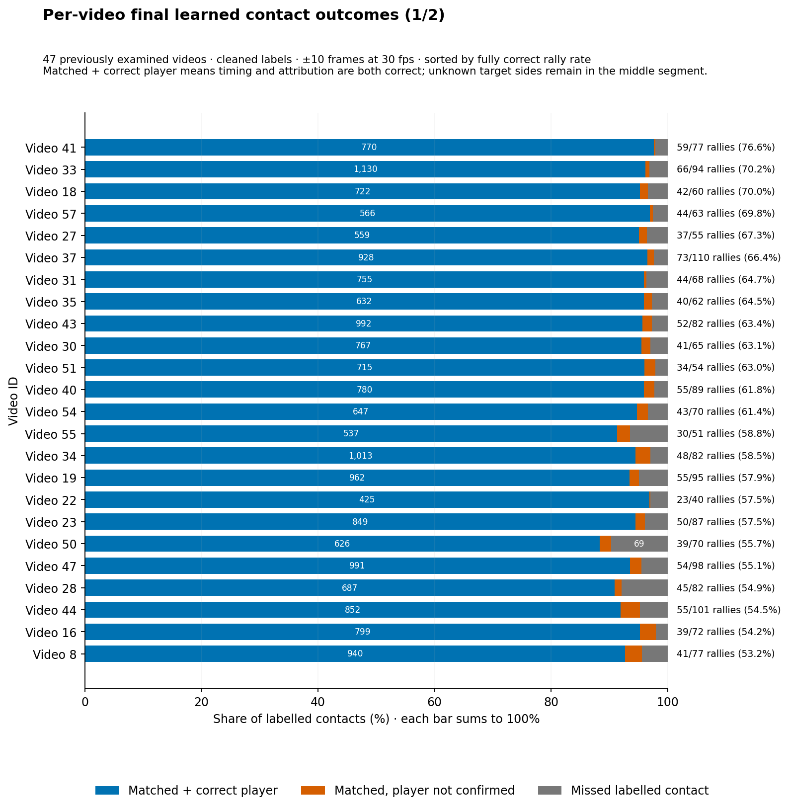
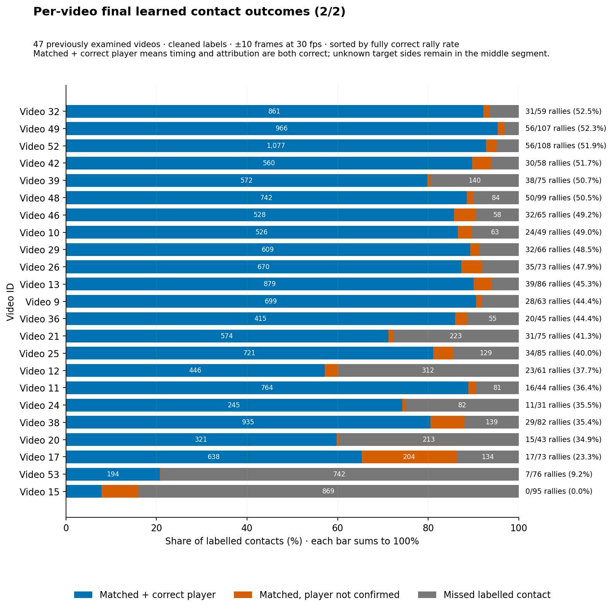
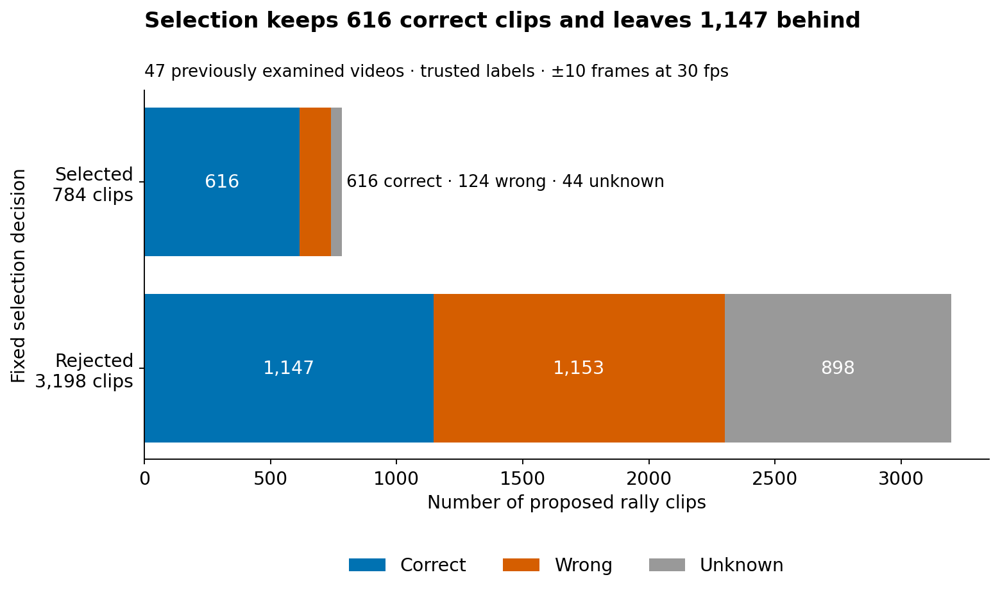
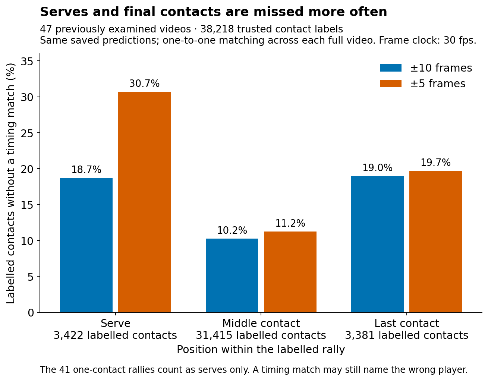
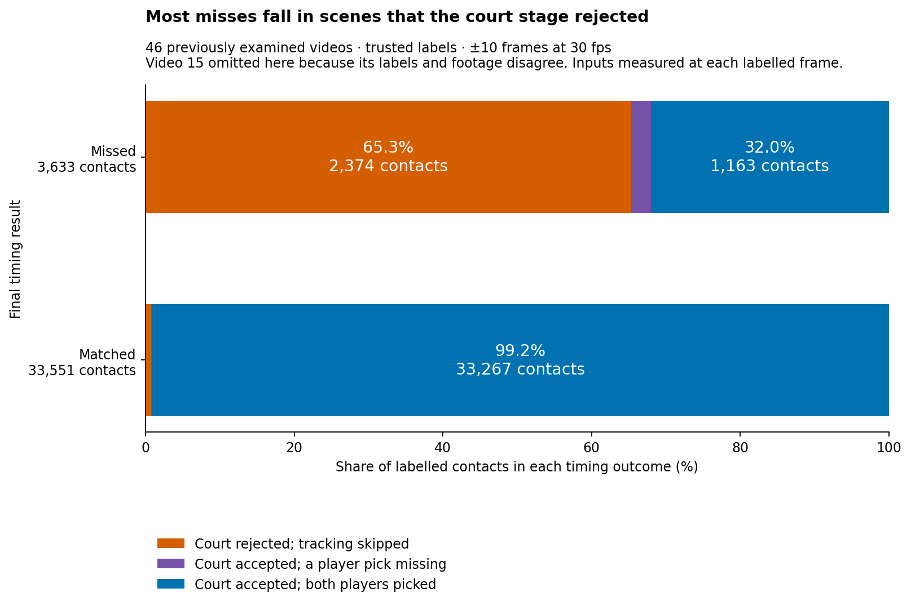

# Output errors: what remains after the annotator runs

A high contact match rate does not guarantee a usable rally. One missing, extra or wrongly assigned hit is enough to break the sequence.

The checks below count these problems before and after clip selection, and show which ones occur together. They also compare errors across videos and positions within a rally.

**Contents**  
[Video-to-video variation](#video-to-video-variation)  
[Rally coverage before selection](#rally-coverage-before-selection)  
[What selection keeps](#what-selection-keeps)  
[Errors inside selected clips](#errors-inside-selected-clips)  
[Matched contacts are usually close](#matched-contacts-are-usually-close)  
[Starts and finishes are harder](#starts-and-finishes-are-harder)  
[Player assignment](#player-assignment)  
[Rally length](#rally-length)  
[Per-video viewer](#per-video-viewer)  
[What remains with good upstream inputs](#what-remains-with-good-upstream-inputs)

Figures marked 47 videos include video 15, whose labels point to the wrong footage. The 46-video results exclude it. “Trusted” in older figures means cleaned labels.

## Video-to-video variation

Across the historical 47 videos, the median video has a 94.1% timing-match rate and a 53.2% fully correct-rally rate when each video gets equal weight.

At the high end:

- video 41: 59/77 fully correct (76.6%);
- video 33: 66/94 (70.2%);
- video 18: 42/60 (70.0%).

At the weak end, causes differ: video 53 is dominated by court rejection; video 17 mostly fails later; video 38 is mixed; video 15 is not a valid quality case at all. See [evaluation_tables.md](evaluation_tables.md).

The charts below separate missed hits from timing matches with the wrong or unconfirmed player. The rally score beside each bar shows how often all the details come together. Bars cover labelled contacts; unmatched extra predictions are shown separately in the [interactive viewer](VIDEO_BREAKDOWN.html).

These are the original 47-video results. Video 15 stays visible to explain the investigation, but is excluded from the main benchmark. Video 53 stays in that benchmark because its checked labels agree with the footage.

## Rally coverage before selection

For the 46 videos outside video 15, the 3,327 cleaned rallies have these best available outputs:

| Best available clip | Rallies |
|---|---:|
| Fully correct | **1,763** |
| Contains all labels, but has another error | 1,226 |
| Reaches some labels, but not the whole rally | 113 |
| Reaches no labelled contact | 225 |

A clip can contain every labelled contact and still fail because it has extras, another rally's contacts or wrong players.

The figure preserves the original 47-video breakdown; the table above removes video 15.

The 225 unreached rallies remain after removing video 15. Without video 53 as well, 169 remain, so this is not just an outlier problem.

## What selection keeps

The fixed ranking rule leaves 747 clips on the 46-video read:

- **616 correct**;
- **114 wrong**;
- **17 unjudgeable**.

That is 84.4% correct among the 730 judgeable clips, or 82.5% if unknowns stay in the denominator.

Selection makes review denser but leaves many good clips behind: 1,763 rallies have a fully correct proposal before selection, while the selected queue contains 616 of them. The threshold was not retuned here.

This historical figure includes video 15. Removing it leaves the same 616 correct selected clips; wrong and unknown counts change to those above.

## Errors inside selected clips

The historical 47-video queue has 124 known-wrong clips:

| Problem | Clips affected |
|---|---:|
| Extra contacts | 92 |
| Missing contacts | 74 |
| Wrong player on a matched contact | 10 |
| Rally cut off | 12 |

Categories overlap. None of the 124 fails only because of player assignment.

Video 15 badly distorts event counts, so the event-level breakdown below uses the 114 wrong clips outside it.

### Extra events

| Position | Events |
|---|---:|
| Before first label | 2 |
| Between first and last labels | 31 |
| After final label | **52** |
| **Total** | **85** |

### Missed labelled events

| Position | Events |
|---|---:|
| Serve | **35** |
| Middle | 8 |
| Final | **24** |
| **Total** | **67** |

These are event counts matched within each selected clip, not full-video contact counts.

In the historical 124-clip view, the largest exclusive combinations are 49 extras-only, 28 misses-only, 28 with both, and nine with misses + extras + a cut-off rally. Ten clips have a wrong matched player; all ten also have another error.

Serves and rally ends are good places to inspect, but “after the final label” is not proof that a physical hit is false. Earlier deletion work could not separate real tail contacts from bad extras reliably.

## Matched contacts are usually close

Outside video 15 there are 33,551 timing matches:

| Distance from label | Matches | Share |
|---|---:|---:|
| Exact frame | 9,012 | 26.9% |
| Within 2 frames | 28,035 | 83.6% |
| Within 5 frames | 32,878 | 98.0% |

Median offset is zero; mean offset is about half a frame early. This is not a case for globally shifting predictions: the table contains only contacts that already match, and says nothing about the 3,633 misses.

Historical prediction-side P/R/F1 and all-source accounting are in [label_accounting.md](label_accounting.md).

## Starts and finishes are harder

Among court-accepted frames outside video 15:

| Contact position | Missed | Total | Miss rate |
|---|---:|---:|---:|
| Serve | 253 | 2,804 | 9.0% |
| Middle | 663 | 28,704 | 2.3% |
| Final | 343 | 3,062 | 11.2% |

Single-contact rallies count as serves only. The ±5-frame check hurts serves especially strongly.

For historical comparison, the full 47-video output at ±10 frames matches 2,781/3,422 serves, 28,195/31,415 middle contacts and 2,740/3,381 finals. Those counts include court-rejected frames, so they answer a different question from the accepted-scene table above.

## Player assignment

In the historical 47-video result, 33,715 timing matches have a known target side. The learned output gets 32,667 right (**96.9%**):

| Labelled side | Predicted far | Predicted near | No player |
|---|---:|---:|---:|
| Far | 16,183 | 410 | 0 |
| Near | 632 | 16,484 | 6 |

That leaves 1,042 near/far confusions and six unassigned predictions. Near/far is image position, not persistent athlete identity across camera or end changes.

Within the historical selected queue, ten wrong clips have a wrong player on a matched contact, but every one also has another error.

## Rally length

Historical 47-video counts show only a modest drop for the longest rallies:

| Rally length | Fully correct | Rate |
|---|---:|---:|
| 1–5 contacts | 517/989 | 52.3% |
| 6–10 | 536/1,039 | 51.6% |
| 11–20 | 505/967 | 52.2% |
| More than 20 | 205/427 | 48.0% |

Length is not the main explanation for the current failures.

## Per-video viewer

[`VIDEO_BREAKDOWN.html`](VIDEO_BREAKDOWN.html) is a self-contained local viewer for each of the 47 videos and both saved output methods. It shows:

- labelled far/near player against predicted far/near, missing player and missing hit;
- unmatched predictions separately;
- contact, serve and whole-rally scores;
- court/player availability at matched and missed times;
- correct, wrong and unjudgeable selected clips.

The page has 94 video/method choices. Validation checked every confusion matrix against its labelled-contact count and rendered all 94 choices in JavaScript. Rebuild command: [evaluation_reproduction.md](evaluation_reproduction.md).

## What remains with good upstream inputs

There are still **1,163 missed labels** outside video 15 where the court is accepted and both players are available. Those are the right cases for later contact-model work; do not mix them with the 2,374 misses that never got through the court gate.

The bars describe input states within each outcome group, rather than the probability of a miss given that input. [Court checks](court_failures.md) follow the sampled failures through footage and replays.

After #148, sample these residuals directly across serves, middles and finals. Separate label problems, missing candidates, bad sequence choices and boundary/scene-transition cases before choosing another model change. See [promising_leads.md](promising_leads.md).
