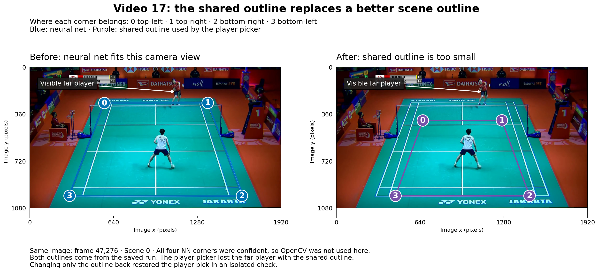

# The annotator investigation, in pictures

This branch checked where the finished badminton annotator fails and what needs fixing. It compared saved outputs with labels and court/player inputs, inspected footage, and replayed court decisions. The detector stayed fixed.

The main results cover **46 ShuttleSet22 videos**, after excluding video 15's misaligned labels. Scores use cleaned labels and **±10 frames at 30 fps**. These videos had already been examined during earlier work.

## How much does it vary between videos?

A fully correct rally fits in one clip: every labelled hit matched once, the right players, and no extra hits.

Most videos match a high share of hits, but whole-rally success varies widely. This plot and the next two show the original **47 videos**, including video 15's invalid label comparison. “Trusted” in older plots means cleaned labels.

The bars count labelled hits. The scores alongside count fully correct rallies. Extra predictions are separate in the [interactive video breakdown](VIDEO_BREAKDOWN.html), which also shows player confusion and input conditions. Open it locally to explore each video.

## Does every rally get a complete clip?

Even before selection, some rallies are only partly reached or missed entirely. After excluding video 15, **225 rallies** still have no labelled contact reached by a clip.

## What does selection leave behind?

Selection makes the review queue cleaner, but discards many correct clips too. Excluding video 15 leaves the same 616 correct selected clips: none came from that video. The threshold stayed fixed during this investigation.

## What kinds of errors occur together?

This older breakdown includes **all 47 videos**, including video 15. “Trusted” means cleaned labels, not labels verified against footage.

## Are hits mistimed, or missing?

**98.0% of matches are within five frames.** The 3,633 missing contacts are outside this plot.

Starts and finishes are harder. That pattern remains after removing video 15 and restricting to court-accepted frames: **9.0%** missed serves, **2.3%** middles, **11.2%** finals.

## What inputs were available?

Most misses fall in court-rejected scenes; almost all matches have both players available. These are input states within each outcome group. Footage and replays test what caused particular failures.

## Do the labels agree with the footage?

Video 15's labels refer to the wrong parts of the match. The decision is to exclude it and its derived clips.

These 24 cases were sampled from **misses across all 47 videos**. All three clear contradictions are from video 15. This is not a collection-wide label-error rate.

## Can the court failures be reproduced?

Changing only the outline changed the court/player decisions in the checked cases. A full rerun is still needed to measure recovered contacts and rallies.

## What useful output is left for review?

The 46-video queue is **84.4% correct among its 730 judgeable clips**. Another 17 clips remain unjudgeable. These clips still need review before use as ground truth.

## What did the learned detector improve?

The middle column is the main result. The last column tests how much video 53 affects the totals; its labels support keeping it.

## What about original ShuttleSet?

The 32 original videos were **development data**. This comparison uses the historical 47-video ShuttleSet22 totals. Eight more original videos still need inputs prepared for the final chooser.

## What next?

- **Fix the court stage and rerun.** The two reproduced failures give concrete cases to check.
- **Exclude video 15; keep video 53.** Check the wider release for other bad video/label pairings.
- **Then inspect the remaining contact errors.** Use the new results to decide what the detector needs next.

[Full report](README.md) · [What was checked](experiment_lineage.md) · [Earlier detector experiments](last_followups.md) · [Saved evidence and commands](evaluation_reproduction.md)
