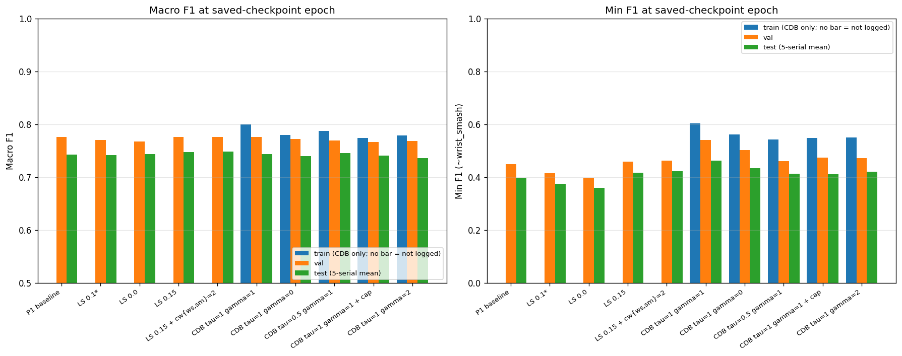
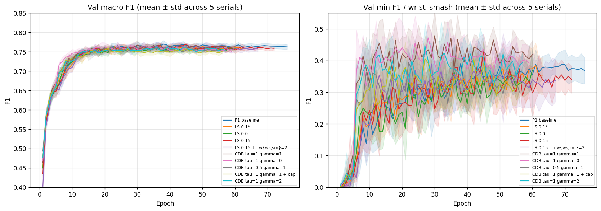
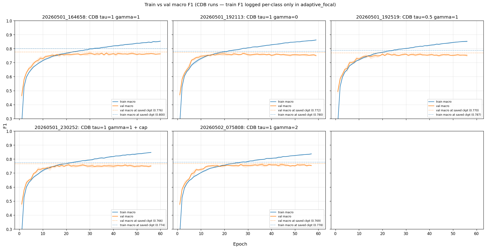
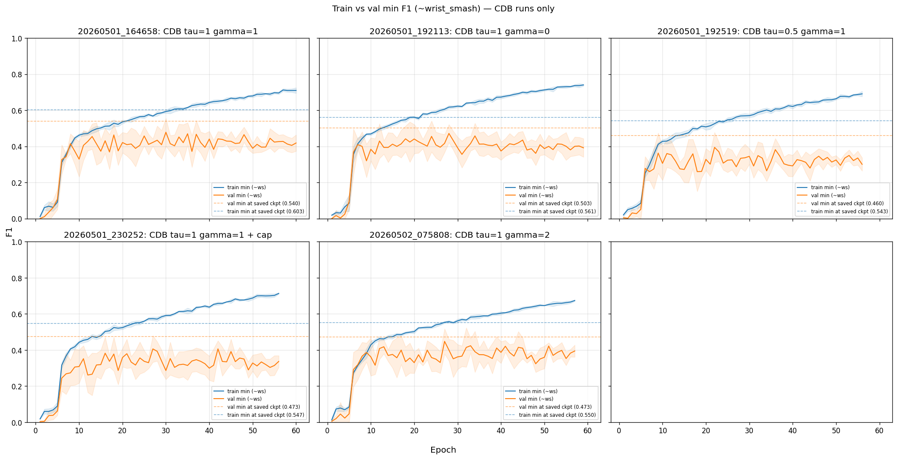
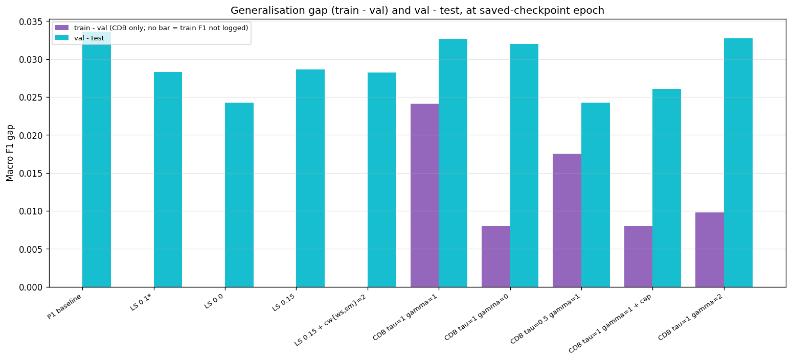
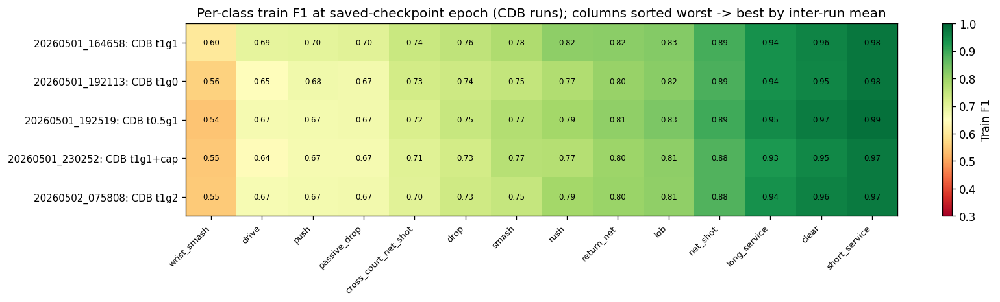
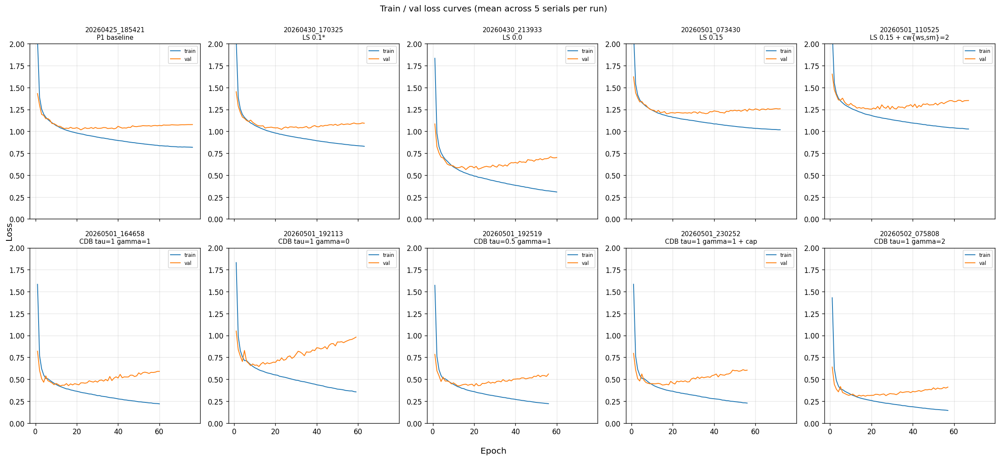

# Train vs val vs test analysis: nosides series

The capacity-bottleneck question is operationally answered by the train F1 vs val/test F1 gap at the early-stop best epoch. A wide gap suggests rep capacity exists but doesn't generalise (regularisation / data story); a narrow gap suggests capacity is genuinely capped.

## Headline read

- **Macro plateau is not a clean capacity ceiling.** At best val epoch, train macro is 0.77-0.80 across CDB runs while val sits at 0.77 and test at 0.74. By end of training train macro reaches 0.85-0.86 while val falls back from its peak. The model has roughly 6-9 pp of train headroom over val that doesn't transfer to test, so the plateau lives in generalisation, not raw capacity.
- **Min/ws plateau is mostly a generalisation gap.** At end of training, train ws reaches 0.69-0.75 across CDB runs (γ=2 the lowest at 0.69, γ=1 baseline the highest at 0.73). Test ws lands at 0.41-0.46. That's a 25-30 pp train-test gap on the confusion class. The model has the capacity to fit ws on training data; the features it learns don't transfer.
- **Per-class structure is informative.** Pose-distinctive classes (services, clear) generalise nearly perfectly: train ≈ test within 1-2 pp. Pair-confusion classes (smash, ws) carry the biggest gaps (15-25 pp). Mid-frequency tail (drop, drive, push, rush) sits in between.
- **Caveat on coverage**: train F1 per class is only logged in CDB runs (because the adaptive-focal loss needs it). Non-CDB runs (LS sweep, class-weighted, P1 baseline) only log train *loss*, so train-vs-val-vs-test on F1 is restricted to five of the ten runs (the four CDB cells from 2026-05-01 plus the γ=2 follow-up run_20260502_075808). Future non-CDB runs will have it: an unconditional `F1_train/<class>` plus `F1_train/macro` / `F1_train/min` summaries were added to bst_train.py on 2026-05-02.

## What's logged where

| Tag | Logged in | Used for |
|---|---|---|
| `Loss/Train`, `Loss/Val` | All 9 runs | Loss-curve check (overfit signal at the loss level) |
| `F1/Val_macro`, `F1/Val_min` | All 9 runs | Val curves + early-stop trigger |
| `F1_train/<class>` | CDB runs only (4) | Per-class train F1 (drives adaptive alpha) |
| `Alpha/<class>` | CDB runs only (4) | Per-class loss weight trajectory |
| Test scores | Manifest yaml (per-serial) | Mean across 5 serials reported in tables below |

For non-CDB runs there's no per-epoch train F1, so the train-vs-val-vs-test triangle below uses train loss as a proxy on those rows. That's a real asymmetry across runs.

## Per-run summary at saved-checkpoint epoch

Mean across 5 serials, all values read at the saved-checkpoint epoch (val-macro peak).

| Run | Train F1 | Val F1 | Test F1 | Train min | Val min | Test min | Train L | Val L |
|---|---|---|---|---|---|---|---|---|
| run_20260425_185421 (P1) | -- | 0.776 | 0.743 | -- | 0.449 | 0.397 | 0.893 | 1.022 |
| run_20260430_170325 LS 0.1\* | -- | 0.770 | 0.742 | -- | 0.415 | 0.375 | 0.921 | 1.020 |
| run_20260430_213933 LS 0.0 | -- | 0.768 | 0.743 | -- | 0.397 | 0.359 | 0.379 | 0.619 |
| run_20260501_073430 LS 0.15 | -- | 0.776 | 0.747 | -- | 0.459 | 0.417 | 1.088 | 1.190 |
| run_20260501_110525 LS 0.15 + cw | -- | 0.776 | 0.748 | -- | 0.463 | 0.422 | 1.116 | 1.227 |
| run_20260501_164658 CDB τ1γ1 | **0.800** | 0.776 | 0.743 | **0.603** | 0.540 | 0.462 | 0.309 | 0.451 |
| run_20260501_192113 CDB τ1γ0 | 0.780 | 0.772 | 0.740 | 0.561 | 0.503 | 0.434 | 0.545 | 0.663 |
| run_20260501_192519 CDB τ0.5γ1 | 0.787 | 0.770 | 0.745 | 0.543 | 0.460 | 0.412 | 0.334 | 0.428 |
| run_20260501_230252 CDB τ1γ1+cap | 0.774 | 0.766 | 0.740 | 0.547 | 0.473 | 0.411 | 0.350 | 0.438 |
| run_20260502_075808 CDB τ1γ2 | 0.779 | 0.769 | 0.736 | 0.551 | 0.473 | 0.421 | **0.222** | 0.318 |

`--` marks where train F1 isn't logged. Bold marks: CDB τ1γ1 wins train F1 and train min across the five CDB runs at saved-checkpoint epoch; CDB τ1γ2 lands the lowest train loss.

A note on the loss columns. They're kept for completeness but aren't the focus. Two reasons: (1) CE is sample-mean over the batch, so loss reflects head-class fitness much more than tail-class learning, which is the axis the F1 / min split exposes more directly. (2) Label smoothing inflates absolute loss by an entropy offset that varies with LS, so cross-run loss comparisons between LS=0 / LS=0.1 / LS=0.15 runs are apples-to-oranges. CDB τ1γ2's lowest train loss reflects crisp targets + the aggressive γ=2 modulator clipping per-sample loss magnitude, not a meaningfully tighter fit. F1 columns are the cleaner signal for the train-vs-val gap question.

## Per-class train vs test at saved-checkpoint epoch (CDB τ1γ1, the winner run)

Cleanest single-run breakdown of where the train-test gap comes from. Rows sorted by test F1 ascending (worst-performing class first), so the gap reads top-down from biggest to smallest.

| Class | train (saved ckpt) | test | gap |
|---|---|---|---|
| wrist_smash | 0.60 | **0.46** | **+0.14** |
| smash | 0.78 | **0.60** | **+0.18** |
| drive | 0.69 | 0.61 | +0.09 |
| push | 0.70 | 0.65 | +0.05 |
| passive_drop | 0.70 | 0.65 | +0.05 |
| cross_court_net_shot | 0.74 | 0.66 | +0.09 |
| drop | 0.76 | 0.66 | +0.10 |
| rush | 0.82 | 0.74 | +0.08 |
| lob | 0.83 | 0.78 | +0.05 |
| return_net | 0.82 | 0.81 | +0.00 |
| net_shot | 0.89 | 0.89 | -0.00 |
| clear | 0.96 | 0.95 | +0.01 |
| long_service | 0.94 | 0.97 | -0.04 |
| short_service | 0.98 | 0.98 | +0.00 |

Three groupings emerge (top-down: worst, then middle, then heads):

- **Worst offenders**: wrist_smash (+14 pp train-test gap) and smash (+18 pp). The pair-confusion cost is concentrated in the train-test divergence, not in raw rep capacity.
- **Mid-frequency tail** (drive, push, passive_drop, cross_court_net_shot, drop, rush, lob): meaningful 5-10 pp gap. The model fits these on train but doesn't generalise as cleanly as the heads.
- **Pose-distinctive heads** (return_net, net_shot, clear, services): train ≈ test. The model's features for these classes generalise cleanly. Some test scores even land *higher* than train (long_service test 0.974 vs train 0.937), so there's no overfit pressure on these classes.

## Charts

### Summary bars: train (CDB only) vs val vs test at best val epoch

Where the train bar is missing entirely (no bar at all for that run's train side), train F1 wasn't logged for that run. Legend entry spells this out as "no bar = not logged".

Macro panel: val and test bars cluster tightly (all val 0.76-0.78, all test 0.74-0.75). Train bars on CDB runs sit only 1-3 pp above val at best val epoch — the early-stop fires before the train-val split widens.

Min panel: val/test bars track each other within ~6-10 pp; train min on CDB runs sits 5-15 pp above val. The CDB family's shared gain on min is visible at the val/test level (~+5 pp over LS=0.1 baseline).

### Val F1 curves across all 10 runs

Val macro panel: every run peaks in a tight band 0.76-0.78. Curves rise together for ~25-35 epochs then flatten. The plateau is *the same height* regardless of loss config; only the trajectory shape and early-stop timing differ.

Val min panel: clearer separation here. CDB runs (especially τ1γ1) lift the min curve by 5-7 pp above the LS-only baselines. The class-weighted run (orange-ish) and CDB τ1γ1 (purple-ish) cluster at the top.

### Train vs val macro for CDB runs

Each panel shows mean ± std across 5 serials. The orange dashed horizontal line is the val macro at the saved-checkpoint epoch (mean across the 5 serials of *that run*); the blue dashed horizontal line is train macro at the same epoch. The gap between them is the train-val gap at the saved-checkpoint moment.

Important observation: at the best val epoch, train and val tracks are within 2-3 pp of each other across all five CDB runs. They diverge *after* that point: train continues climbing toward 0.85-0.86, val plateaus or slowly declines.

### Train vs val min for CDB runs

Same horizontal-reference convention as the macro chart: orange line = val min at saved-checkpoint epoch, blue line = train min at the same epoch (both means across the 5 serials of that run). The min/ws curves show a wider gap structure than macro: by end of training, train min is 0.69-0.75 while val min is 0.45-0.55. Roughly a 20 pp persistent gap on the bottleneck class — much wider than the macro gap.

### Generalisation gap analysis

Train-val and val-test gaps at the best val epoch. Two readings:

- Train-val gap (purple) is small at best val epoch (~1-2 pp) — early-stop fires before significant divergence. This is *not* the train-val gap that's interesting; it's just the snapshot at peak val.
- Val-test gap (cyan) is consistently ~3-4 pp across all runs. That's the train-test distribution shift the model can't paper over.

The visual message: at the early-stop moment we're cherry-picking, we don't see the gap that opens up by end of training. Need to read the train-vs-val curves directly to see the full picture.

### Per-class train F1 heatmap (CDB runs)

Train F1 at best val epoch, per class, across 5 CDB runs (now including γ=2 / run_20260502_075808). Confirms the structure: services + clear + net_shot saturate near 1.0 across all runs; smash and wrist_smash sit at 0.6-0.7, even after CDB-driven alpha pressure. γ=2 (top row) doesn't push smash or ws meaningfully higher than γ=1 at the best val epoch.

### Loss curves

Train and val loss per run. Note absolute scales differ (LS-smoothed targets give different loss magnitudes from CDB or LS=0). Within-run shape is the readable signal: CDB runs show a relatively narrow train-val loss gap; LS=0 baseline shows a wider gap because target sharpness amplifies it.

## Reading the picture

The data argues against a clean "model is at capacity" story for the macro plateau, and toward a **generalisation-bound on confusion pairs and mid-frequency tail**. Specifically:

1. **The model has unused capacity on training data.** Train macro reaches 0.86 by end of training while val plateaus at 0.78. If raw capacity were the cap, train wouldn't be able to climb past 0.78 either. So the plateau lives in the train-val divergence.

2. **Where capacity headroom exists, the gap is structural.** Smash and wrist_smash carry 14-18 pp train-test gaps at saved-checkpoint epoch. These are the same classes that label-noise concerns flag. Adding more representational capacity doesn't obviously close a gap whose width is set by label-consistency between train and test splits.

3. **Where features generalise, train ≈ test.** Services, clear, net_shot all sit within 1-2 pp train-vs-test. The encoder *can* learn generalisable features when the class is pose-distinctive. The bottleneck isn't a uniform "rep is too small" — it's "rep doesn't separate the confusable classes specifically."

4. **The Kang et al. cRT hypothesis is testable cheaply.** If the classifier head is what's failing on the confusable classes (rather than the encoder), retraining the head with class-balanced sampling on a frozen encoder should lift test ws toward train ws. If it doesn't, the encoder's features genuinely don't separate ws from smash and capacity widening is the next axis.

5. **X3D-S fusion is the right structural answer for the pair confusion.** The pose-only stream apparently can't separate smash from wrist_smash (label noise contributes, but pose is also genuinely close on these strokes). The video stream provides arm/wrist pose detail that pose-2D extraction throws away. Adding it should specifically attack the train-test gap on the confusion pairs, which is where the macro plateau is concentrated.

## Open questions for follow-up

- **Every CDB knob now tested.** With γ=2 / run_20260502_075808 in the books (test macro 0.7359, test min 0.4207, both below the γ=1 baseline), every untouched CDB knob has been run. The full CDB spread on test min is 0.41-0.46, with γ=1 at the top. No CDB run breaks the macro 0.74-0.75 cluster on test. Loss-side options remaining are bigger swings: Seesaw-F1 (pair-aware mitigation matrix) or two-stage cRT/LWS (Kang et al.).
- **Two-stage cRT/LWS test**: train BST end-to-end vanilla, freeze encoder, retrain `mlp_head` with class-balanced sampling for 10-20 epochs. Cheapest test of the encoder-vs-classifier bottleneck question. Project decision pending on whether to spend the time on it before X3D-S fusion.
- **Architecture 2 cross-check**: the RGB-3dCNN-core model on the same data. If it caps near 0.75 macro too, the data is the limit; if it breaks through, BST-specific shape is the bottleneck.
- **Per-class augmentation experiment**: Isiah's augmentation writeup at `scratch/research/Augmentation.pdf` proposes class-aware augmentation. If applied selectively to smash/ws/mid-tail classes (the ones with the train-test gap), it directly attacks the generalisation problem this analysis surfaces.
- **Label-noise floor estimate**: a small manually-relabelled sample on smash/ws clips would let us bound the label-noise contribution to the train-test gap. Bigger research effort, beyond near-term scope.

## Methodology notes

- Per-run aggregates use mean across 5 serials. Variance band on chart curves is ±1 std.
- "Best val epoch" is read from `best/macro_f1_epoch` in TB scalars (the trainer's own early-stop trigger record).
- Train F1 per class is computed by `accumulate_class_counts` in `train_one_epoch` from the running argmax during the epoch's forward passes; not held-out evaluation. Macro is the unweighted mean across 14 active classes; min is the lowest per-class F1.
- Test scores are pulled from each run's `manifest.yaml` per-serial metrics.
- Generation scripts: `scratch/architecture_notes/scripts/extract_tb.py` (TB scalar extractor, dumps to `/tmp/nosides_tb_extract.json`) + `scratch/architecture_notes/scripts/analyse_tb.py` (tables + matplotlib charts, reads the JSON). Charts at `scratch/architecture_notes/charts/`. Both scripts need `numpy`, `pandas`, `matplotlib`, `pyyaml`, `tensorboard`.
- Rerun workflow when a new run lands:
    1. Pull the experiment dir + test_log down from bourbaki.
    2. Append the new `(run_id, label)` to the `NOSIDES_RUNS` list at the top of `extract_tb.py` and the matching entry in the `ORDER` list at the top of `analyse_tb.py`. CDB runs also need to be added to the four `cdb_runs` lists inside `analyse_tb.py` (the per-CDB charts).
    3. From repo root: `python scratch/architecture_notes/scripts/extract_tb.py` (rebuilds the JSON for all listed runs).
    4. From repo root: `python scratch/architecture_notes/scripts/analyse_tb.py` (rewrites the table to stdout and overwrites `scratch/architecture_notes/charts/*.png`).
    5. Update the per-run summary table and any prose numbers in this doc that reference the new run.
