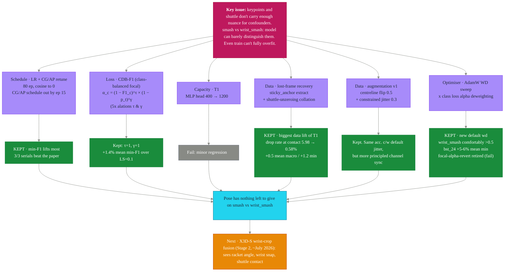

# Ablation story

T1 ablation summary, tightened for general audiences. Full reference: [`ablation_story_canonical.md`](ablation_story_canonical.md).

```mermaid
%%{init: {'theme':'base','themeVariables':{
  'primaryColor':'#a78bfa',
  'primaryTextColor':'#1f2937',
  'primaryBorderColor':'#7c3aed',
  'lineColor':'#888a85',
  'secondaryColor':'#22d3ee',
  'tertiaryColor':'#f4f4f5',
  'tertiaryBorderColor':'#d1d5db',
  'tertiaryTextColor':'#374151',
  'edgeLabelBackground':'#ffffff',
  'fontFamily':'sans-serif'
}}}%%
flowchart TB

  pair["<b>Key issue:</b> keypoints and shuttle don't carry enough nuance for confounders.<br/>smash vs wrist_smash: model can barely distinguish them. Even train can't fully overfit."]

  pair --> b1
  pair --> b2
  pair --> b3
  pair --> b4
  pair --> b5
  pair --> b6

  b1["Schedule · LR + CG/AP retune<br/>80 ep, cosine to 0<br/>CG/AP schedule out by ep 15"]
  b2["Loss · CDB-F1 (class-balanced focal)<br/>α_c = (1 − F1_c)^τ × (1 − p_t)^γ<br/>(5x alations τ &amp; γ"]
  b3["Capacity · T1<br/>MLP head 400 → 1200"]
  b4["Data · lost-frame recovery<br/>sticky_anchor extract<br/>+ shuttle-unzeroing collation"]
  b5["Data · augmentation v1<br/>centreline flip 0.5<br/>+ constrained jitter 0.3"]
  b6["Optimiser · AdamW WD sweep<br/>x class loss alpha deweighting"]

  b1 --> v1["KEPT · min-F1 lifts most<br/>3/3 serials beat the paper"]
  b2 --> v2["Kept: τ=1, γ=1<br/>+1.4% mean min-F1 over LS=0.1"]
  b3 --> v3["Fail: minor regression"]
  b4 --> v4["KEPT · biggest data lift of T1<br/>drop rate at contact 5.98 → 0.58%<br/>+0.5 mean macro / +1.2 min"]
  b5 --> v5["Kept. Same acc. c/w default jitter,<br/>but more principled channel sync"]
  b6 --> v6["KEPT · new default wd<br/>wrist_smash comfortably >0.5<br/>bst_24 +5-6% mean min<br/>focal-alpha-revert retired (fail)"]

  v1 --> c
  v2 --> c
  v3 --> c
  v4 --> c
  v5 --> c
  v6 --> c

  c["Pose has nothing left to give on smash vs wrist_smash"]

  c --> nxt["Next · X3D-S wrist-crop fusion (Stage 2, ~July 2026): sees racket angle, wrist snap, shuttle contact"]

  classDef bottleneck fill:#be185d,stroke:#9f1239,color:#ffffff
  classDef tried fill:#a78bfa,stroke:#7c3aed,color:#1f2937
  classDef kept fill:#1a8c3c,stroke:#15803d,color:#ffffff
  classDef retired fill:#888a85,stroke:#6b7280,color:#ffffff
  classDef summary fill:#22d3ee,stroke:#0e7490,color:#1f2937
  classDef nxt fill:#e88806,stroke:#c2410c,color:#ffffff

  class pair bottleneck
  class b1,b2,b3,b4,b5,b6 tried
  class v1,v2,v4,v5,v6 kept
  class v3 retired
  class c summary
  class nxt nxt
```
