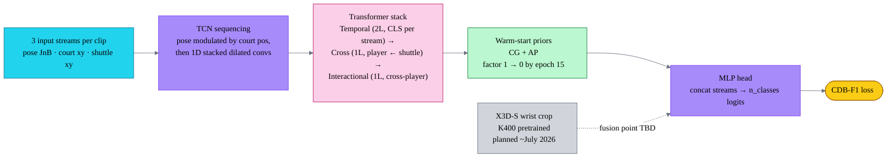
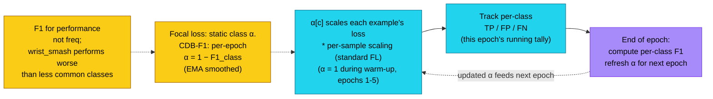

# BST-X model + CDB-F1 loss

Compact view of the forward pass and how the loss reweights classes between epochs. Full reference: [`bst_x_model_canonical.md`](bst_x_model_canonical.md).

## Forward pass

## CDB-F1 loss

