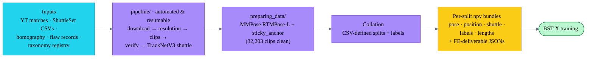

# Data pipeline

Raw match video to ready-to-train arrays in one resumable command. Full reference: [`data_pipeline_canonical.md`](data_pipeline_canonical.md).

```mermaid
%%{init: {'theme':'neutral','themeVariables':{
  'primaryColor':'#a78bfa',
  'primaryTextColor':'#000000',
  'primaryBorderColor':'#7c3aed',
  'lineColor':'#6b7280',
  'background':'#ffffff',
  'fontFamily':'sans-serif'
}}}%%
flowchart LR

  inputs["Inputs<br/>YT matches · ShuttleSet CSVs ·<br/>homography · flaw records ·<br/>taxonomy registry"]
  pipe["pipeline/ · automated &amp; resumable<br/>download → resolution → clips →<br/>verify → TrackNetV3 shuttle"]
  pose["preparing_data/<br/>MMPose RTMPose-L + sticky_anchor<br/>(32,203 clips clean)"]
  coll["Collation<br/>CSV-defined splits + labels"]
  npy["Per-split npy bundles<br/>pose · position · shuttle ·<br/>labels · lengths<br/>+ FE-deliverable JSONs"]
  nxt(["BST-X training"])

  inputs --> pipe --> pose --> coll --> npy --> nxt

  classDef input fill:#22d3ee,stroke:#0e7490,color:#000000
  classDef step fill:#a78bfa,stroke:#7c3aed,color:#000000
  classDef out fill:#facc15,stroke:#a16207,color:#000000
  classDef nextd fill:#bbf7d0,stroke:#15803d,color:#000000

  class inputs input
  class pipe,pose,coll step
  class npy out
  class nxt nextd
```
