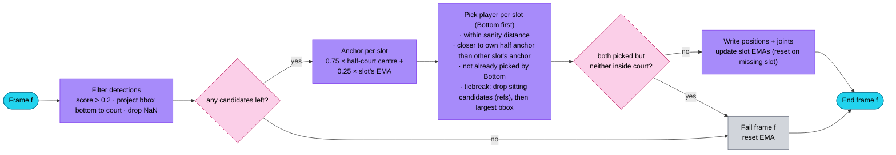

# sticky_anchor

One-frame trace through the player-detection heuristic. Full reference: [`sticky_anchor_canonical.md`](sticky_anchor_canonical.md).

```mermaid
%%{init: {'theme':'neutral','themeVariables':{
  'primaryColor':'#a78bfa',
  'primaryTextColor':'#000000',
  'primaryBorderColor':'#7c3aed',
  'lineColor':'#888a85',
  'secondaryColor':'#22d3ee',
  'tertiaryColor':'#f4f4f5',
  'tertiaryBorderColor':'#d1d5db',
  'tertiaryTextColor':'#000000',
  'edgeLabelBackground':'#ffffff',
  'background':'#ffffff',
  'fontFamily':'sans-serif'
},'themeCSS':'.edgeLabel,.edgeLabel *,.edgeLabel span,.edgeLabel p{color:#000000!important;fill:#000000!important}'}%%
flowchart LR

  start([Frame f])

  filter["Filter detections<br/>score &gt; 0.2 · project bbox bottom to court · drop NaN"]

  ok{any candidates left?}

  anchors["Anchor per slot<br/>0.75 × half-court centre +<br/>0.25 × slot's EMA"]

  pick["Pick player per slot (Bottom first)<br/>· within sanity distance<br/>· closer to own half anchor than other slot's anchor<br/>· not already picked by Bottom<br/>· tiebreak: drop sitting candidates (refs), then largest bbox"]

  rally{both picked but<br/>neither inside court?}

  write["Write positions + joints<br/>update slot EMAs (reset on missing slot)"]

  fail["Fail frame f<br/>reset EMA"]

  endf([End frame f])

  start --> filter --> ok
  ok -- yes --> anchors --> pick --> rally
  rally -- no --> write --> endf
  ok -- no --> fail
  rally -- yes --> fail
  fail --> endf

  classDef phase fill:#a78bfa,stroke:#7c3aed,color:#000000
  classDef decision fill:#fbcfe8,stroke:#be185d,color:#000000
  classDef failC fill:#d1d5db,stroke:#6b7280,color:#000000
  classDef startend fill:#22d3ee,stroke:#0e7490,color:#000000

  class filter,anchors,pick,write phase
  class ok,rally decision
  class fail failC
  class start,endf startend
```
