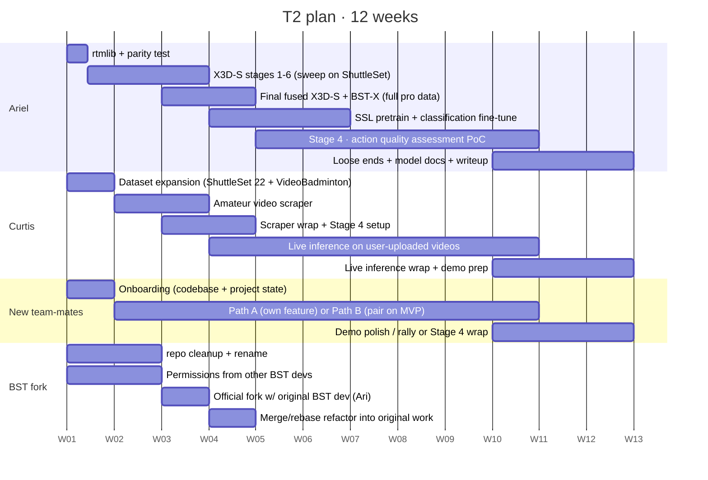
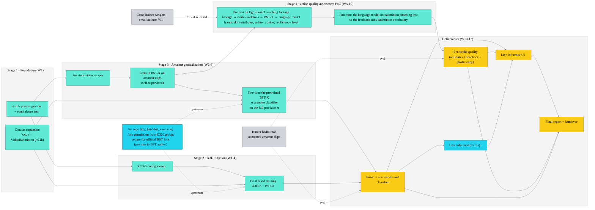

# T2 plan

12-week schedule + how the stages feed each other. Full reference: [`t2_plan_canonical.md`](t2_plan_canonical.md).

## Gantt

```mermaid
%%{init: {'theme':'base','themeVariables':{
  'primaryColor':'#5eead4',
  'primaryTextColor':'#000000',
  'primaryBorderColor':'#0f766e',
  'lineColor':'#6b7280',
  'gridColor':'#e5e7eb',
  'fontFamily':'sans-serif'
},'themeCSS':'svg{background-color:#ffffff!important}.task0,.task1,.task2,.task3{fill:#5eead4!important;stroke:#0f766e!important;stroke-width:1.5px!important}.section0,.section2{fill:#ffffff!important;opacity:1!important}.section1,.section3{fill:#f9fafb!important;opacity:1!important}.sectionTitle,.sectionTitle0,.sectionTitle1,.sectionTitle2,.sectionTitle3{fill:#000000!important;font-weight:600!important}.titleText{fill:#000000!important}.grid .tick text{fill:#000000!important}.taskText,.taskText0,.taskText1,.taskText2,.taskText3{fill:#000000!important}.taskTextOutside0,.taskTextOutside1,.taskTextOutside2,.taskTextOutside3,.taskTextOutsideLeft,.taskTextOutsideRight{fill:#000000!important}'}%%
gantt
    title T2 plan · 12 weeks
    dateFormat YYYY-MM-DD
    axisFormat W%V
    tickInterval 1week
    weekday monday

    section Ariel
        rtmlib + parity test                          :a1, 2025-12-29, 3d
        X3D-S stages 1-6 (sweep on ShuttleSet)        :a2, after a1, 18d
        Final fused X3D-S + BST-X (full pro data)     :a3, 2026-01-12, 14d
        SSL pretrain + classification fine-tune       :a4, 2026-01-19, 21d
        Stage 4 · action quality assessment PoC       :a5, 2026-01-26, 42d
        Loose ends + model docs + writeup             :a6, 2026-03-02, 21d

    section Curtis
        Dataset expansion (ShuttleSet 22 + VideoBadminton)        :c1, 2025-12-29, 7d
        Amateur video scraper                         :c2, 2026-01-05, 14d
        Scraper wrap + Stage 4 setup                  :c3, 2026-01-12, 14d
        Live inference on user-uploaded videos        :c4, 2026-01-19, 49d
        Live inference wrap + demo prep               :c5, 2026-03-02, 21d

    section New team-mates
        Onboarding (codebase + project state)         :n1, 2025-12-29, 7d
        Path A (own feature) or Path B (pair on MVP)  :n2, 2026-01-05, 63d
        Demo polish / rally or Stage 4 wrap           :n3, 2026-03-02, 21d

    section BST fork
        repo cleanup + rename                         :b1, 2025-12-29, 14d
        Permissions from other BST devs               :b2, 2025-12-29, 14d
        Official fork w/ original BST dev (Ari)       :b3, after b2, 7d
        Merge/rebase refactor into original work      :b4, after b1 b3, 7d
```

## Dependency graph

```mermaid
%%{init: {'theme':'base','themeVariables':{
  'primaryColor':'#5eead4',
  'primaryTextColor':'#000000',
  'primaryBorderColor':'#0f766e',
  'lineColor':'#6b7280',
  'secondaryColor':'#22d3ee',
  'tertiaryColor':'#f4f4f5',
  'tertiaryBorderColor':'#d1d5db',
  'tertiaryTextColor':'#000000',
  'edgeLabelBackground':'#ffffff',
  'fontFamily':'sans-serif',
  'fontSize':'20px'
}}}%%
flowchart LR

  subgraph S1["Stage 1 · Foundation (W1)"]
    rtmlib["rtmlib pose migration<br/>+ equivalence test"]
    expand["Dataset expansion<br/>SS22 + VideoBadminton (≈74k)"]
  end

  subgraph S2["Stage 2 · X3D-S fusion (W1-4)"]
    x3d_sweep["X3D-S config sweep"]
    x3d_final["Final fused training<br/>X3D-S + BST-X"]
    x3d_sweep --> x3d_final
  end

  subgraph S3["Stage 3 · Amateur generalisation (W2-6)"]
    scraper["Amateur video scraper"]
    ssl["Pretrain BST-X on amateur clips<br/>(self-supervised)"]
    finetune["Fine-tune the pretrained BST-X<br/>as a stroke classifier<br/>on the full pro dataset"]
    scraper --> ssl --> finetune
  end

  subgraph S4["Stage 4 · action quality assessment PoC (W5-10)"]
    stepA["Pretrain&nbsp;on&nbsp;Ego‑Exo4D&nbsp;coaching&nbsp;footage<br/>footage&nbsp;→&nbsp;rtmlib&nbsp;skeletons&nbsp;→&nbsp;BST‑X&nbsp;→&nbsp;language&nbsp;model<br/>learns:&nbsp;skill‑attributes,&nbsp;written&nbsp;advice,&nbsp;proficiency&nbsp;level"]
    stepB["Fine‑tune&nbsp;the&nbsp;language&nbsp;model&nbsp;on&nbsp;badminton&nbsp;coaching&nbsp;text<br/>so&nbsp;the&nbsp;feedback&nbsp;uses&nbsp;badminton&nbsp;vocabulary"]
    stepA --> stepB
  end

  bst_x["bst&nbsp;repo&nbsp;tidy;&nbsp;bst->bst_x&nbsp;rename;<br>fork&nbsp;permission&nbsp;from&nbsp;C320&nbsp;group;<br>rebase&nbsp;for&nbsp;official&nbsp;BST&nbsp;fork<br>(promise&nbsp;to&nbsp;BST&nbsp;author)"]
  crosstrainer["CrossTrainer weights<br/>email authors W1"]
  hunter["Hunter badminton<br/>annotated amateur clips"]

  subgraph OUT["Deliverables (W10-12)"]
    classifier["Fused + amateur-trained<br/>classifier"]
    quality["Per-stroke quality<br/>(attributes + feedback + proficiency)"]
    live["Live inference (Curtis)"]
    ui["Live inference UI"]
    docs["Final report + handover"]
  end

  rtmlib --> x3d_sweep
  rtmlib --> scraper
  expand --> x3d_final
  expand --> finetune
  ssl --> stepA

  finetune --> classifier
  x3d_final --> classifier
  stepB --> quality

  hunter -. eval .-> classifier
  hunter -. eval .-> quality
  crosstrainer -. fork if released .-> stepA
  bst_x -. upstream .-> x3d_final
  bst_x -. upstream .-> finetune

  classifier --> live
  classifier --> ui
  quality --> ui
  live --> ui

  ui --> docs
  quality --> docs
  classifier --> docs

  classDef stage fill:#5eead4,stroke:#0f766e,color:#000000
  classDef side fill:#22d3ee,stroke:#0e7490,color:#000000
  classDef ext fill:#d1d5db,stroke:#6b7280,color:#000000
  classDef deliv fill:#facc15,stroke:#a16207,color:#000000

  class rtmlib,expand,x3d_sweep,x3d_final,scraper,ssl,finetune,stepA,stepB stage
  class live side
  class hunter,crosstrainer ext
  class bst_x side
  class classifier,quality,ui,docs deliv
```
